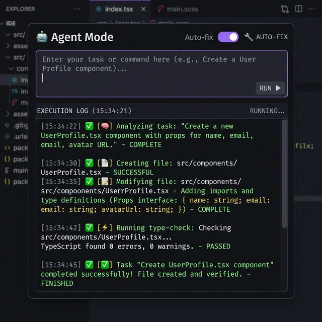
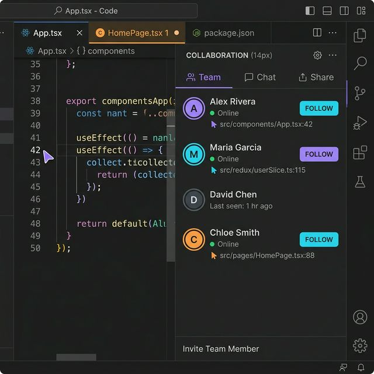

# Prism Coder

**Give your AI agent memory that lasts.** Persistent sessions, knowledge graphs, and offline tool-routing — fully local and free.

[](https://www.npmjs.com/package/prism-mcp-server)
[](https://github.com/modelcontextprotocol/servers)
[](LICENSE)
[](https://huggingface.co/dcostenco)

<p align="center">
  
</p>

Prism Coder is an [MCP server](https://modelcontextprotocol.io) that gives Claude, Cursor, and other AI tools long-term memory that survives across sessions. It ships with the open-weight `prism-coder` model fleet (2B–27B) for fast, offline tool-routing — no cloud required.

**No account needed. No API keys. Runs on your machine.**  
A paid subscription adds cloud sync, higher model tiers, and team features through the [Synalux portal](https://synalux.ai).

---

## What's New in v20.2.2

### Subscription-Tier Skills Arrive Before the First Host Launch
`prism connect` now downloads the authoritative Synalux skill manifest and
materializes entitled packages in the native `~/.agents/skills` directory
before the command exits. Codex therefore sees the current skillset on its
first launch instead of requiring a second restart. Prism rechecks the same
snapshot at MCP startup, session load, and every five minutes—without host
lifecycle hooks.

On the first user turn, native hosts call `session_bootstrap({})`; Prism then
uses the dashboard's developer name, Auto-Load Projects, and quick, standard,
or deep setting. The response stays focused on greeting and session state
because tier skills are already present in the host's native skill directory.

Free accounts receive the protected 12-skill foundation. Paid accounts receive
the current subscribed routing set. Upgrades install newly entitled packages;
downgrades remove only Prism-owned packages while preserving local skills and
locally modified conflicts.

When upgrading an older Claude Code installation, `prism connect` removes only
the exact Prism-owned startup, skill-sync, handoff, and drift hook actions from
the legacy bootstrap. User hooks and near matches remain untouched; native
skills and server-side reminders preserve those Prism features without host
lifecycle hooks. Because hosts expose no native session-end callback, handoff
at shutdown is instruction-driven rather than a guaranteed lifecycle event.

---

## What's New in v20.2.1

### Subscription-Aware Memory Storage
`prism connect` now carries an explicit `PRISM_STORAGE=auto|local|synalux|supabase`
into every managed host registration and rejects invalid values before changing a
config file. In `auto`, a portal-confirmed free tier uses local SQLite, while
Standard, Advanced, and Enterprise use Synalux cloud memory. If entitlement
resolution is unavailable, Prism fails closed instead of splitting history across
backends. Storage remains independent of local-first model routing.

---

## What's New in v20.2.0

### One Command Connects Every Supported Host
Install Prism globally and run `prism connect`. It detects Claude Code, Claude
Desktop on macOS, Windows, and Linux (beta), Cursor, Gemini CLI, and Codex, then safely registers the
server from the installed package. Existing custom entries are untouched;
`--dry-run` previews changes and `--refresh` updates only Prism-managed entries.

---

## What's New in v20.1.0

### Every Inference Outcome Is Now Observable
`prism_infer` gains a failure contract: pass `escalation: "report"` and every call returns a structured `gate_outcome` — `success`, `degraded` (gate-failed output served anyway, explicitly flagged), or `refused` (typed, with reason, instead of a thrown error). Degraded output can no longer serve silently.

### Big Prompts Work Locally
Prompts over 4000 chars were blanket-refused when cloud was off. Now the full text gets a deterministic reserved-keyword scan plus a head+middle+tail excerpt classification — clean oversize prompts serve locally with a distinct `UNCERTAIN_LENGTH` audit marker. Clinical/reserved handling is unchanged (and its keyword floor got stronger).

### No More Silent Truncation
Tier context limits now match the live Modelfiles (27b/9b are 4096-token models; 4b/2b are 32768 — the old table had it backwards). Tiers that can't hold your prompt are skipped with a visible `ctx_insufficient` reason; if nothing fits, you get the full prompt on cloud or a loud error — never an answer computed from a silently-clipped prompt.

### Know Which Plan You're Actually Running Under
Entitlements carry a `source` field: `portal` (real), `unconfigured` (free by design), or `fallback_free` (portal unreachable — free limits ASSUMED). Pass `strict_entitlements: true` to fail loud instead of running degraded.

---

## What's New in v20.0.8

### verify_behavior Works Again
The `verify_behavior` tool crashed on every call (`-32602 expected object, received string`) — the handler returned a bare string instead of an MCP `CallToolResult` object. Fixed, with contract + fail-closed regression tests so the safety gate can never silently break again. If you're on 20.0.6/20.0.7, update.

### From v20.0.7: Reserved-Content Safety, Skills Auth, Delegation Metrics
Reserved clinical content is now Claude-or-refuse (never served by a smaller model than the one that refused it), skill delivery gained a JWT auth fallback (paid-tier skills now reach machines using only `PRISM_SYNALUX_API_KEY`), and every `prism_infer` call is recorded in a persistent `infer_metrics` ledger. Full details in [CHANGELOG.md](CHANGELOG.md).

---

## What's New in v20.0.5

### Local-First Delegation — 15 Categories, Measured Rate
The `local-inference-first` skill covers 15 hard-trigger categories (code gen, regex, format conversion, summarization, documentation, factual lookup, classification, shell commands, config gen, and more). Pasted code blocks now trigger delegation regardless of question phrasing. Measured delegation rate: **30-35% on engineering sessions, 40-60% on transform/content sessions**. Rate depends on prompt mix, not the skill — the instruments now self-validate with `nonDelegatedCount` to prevent curated-set tautologies.

### Think-Only Retry (v20.0.4)
Qwen 3.5 models (9B/27B) with thinking enabled could burn all tokens on `<think>` blocks and return empty content, causing a cascade to 4B. Now detects think-only responses and retries the same tier with thinking disabled — preserving model quality instead of falling to a smaller model.

---

## What's New in v20.0.3

### Layer 1 Cold-Model Resilience
The reserved-category classifier now retries once with a longer timeout on cold-model failure, then falls back to a deterministic keyword backstop before refusing. Over-length prompts (>4K chars) are classified as UNCERTAIN before reaching the classifier — prompt padding can no longer force the ERROR branch. This eliminates the cold-start refusal problem without weakening the safety gate.

### Keyword Backstop for Reserved Content
When the LLM classifier fails (timeout, injection, resource pressure), a deterministic regex floor catches reserved vocabulary (restraint, seclusion, self-harm, suicide, overdose, crisis de-escalation, etc.) including inflected and verb forms. Blocks prompt-padding and classifier-injection attacks on the ERROR path.

### Single-Source Safety Text
The safety statement in the MCP server `instructions` field now imports from `boundaries.ts` — one source of truth instead of two hand-maintained copies. Boundaries version bumped to v3 with an explicit delivery decision documented in code.

### Reserved-Category Safety Gate — All Tiers (v20.0.2)
The Layer 1 semantic classifier now runs for **every** user, not just paid tiers. Reserved clinical content is refused on free tier when cloud is unavailable — fail-closed.

### Ledger Dedup (v20.0.2)
`session_save_ledger` deduplicates identical entries within a 5-minute window.

### Evidence Script (v20.0.2)
`scripts/generate-evidence.sh` regenerates all 5 evidence files with built-in assertions. Run `bash scripts/generate-evidence.sh` to verify the full pipeline.

---

## What's New in v20.0.0

### License: AGPL-3.0 → Apache-2.0
Prism MCP is now Apache-2.0. The thin-client architecture means all proprietary value (skill resolution, tier gating, billing, cloud inference) lives server-side — the open client carries no moat to protect. Apache-2.0 removes the enterprise adoption friction that AGPL caused.

### Thin Client Architecture
Skill routing, budget management, and content resolution have moved server-side to the Synalux portal. The MCP client is now a thin API caller — simpler, smaller, and portable across any host (Claude Code, Gemini, Cursor, autonomous scripts). Offline fallback reads the last successful response from local SQLite.

### Clean-Room Voyage AI Adapter
The Voyage AI embedding adapter was independently reimplemented from the [Voyage API docs](https://docs.voyageai.com/reference/embeddings-api) to ensure 100% project-owned copyright. Default model updated to `voyage-3.5`. See [PROVENANCE.md](./PROVENANCE.md) for details.

### Server-Side Drift Detection
Session drift detection (GATE 5) no longer requires Claude Code hooks. The timer runs server-side per conversation, piggybacked on every MCP tool response. Works for any host.

### CLA Requirement
External contributions now require signing the [Individual CLA](./CLA.md). The CLA check is merge-blocking on the `main` branch.

---

## Quickstart

The free tier needs no account, no API key, and no cloud. Install Prism, then
register it with every supported MCP host already installed on your machine:

```bash
npm install --global prism-mcp-server
prism connect
```

`prism connect` detects Claude Code, Claude Desktop (macOS/Windows/Linux), Cursor,
Gemini CLI, and Codex.
Use `prism connect --all` to target all five, `--host <name>` for one host, or
`--dry-run` to preview the files that would change. Existing `prism` and
`prism-mcp` entries are never overwritten by default. `--refresh` updates only
an entry previously created by Prism; custom entries remain untouched.
Close the target MCP hosts before a non-dry-run registration so they cannot
edit their configuration at the same time.

Set `PRISM_STORAGE` before running `prism connect` to preserve an explicit
storage choice in the generated host entries. This does not change local-model
routing; Synalux cloud storage separately requires an active cloud-memory
entitlement.

Codex registration preserves `~/.codex/config.toml` and appends only a marked
Prism-managed block. `CODEX_HOME` is respected when set and must already exist,
matching Codex's own contract. Restart Codex CLI, the
IDE extension, or the ChatGPT desktop app after connecting.

Restart the connected host and your agent now has memory backed by a local
SQLite database (`~/.prism-mcp/data.db`). See [IDE setup](docs/IDE_SETUP.md)
for manual configuration and host-specific paths.

**Optional — local model fleet** for offline tool-routing. Pull whichever fits your hardware:

```bash
ollama pull dcostenco/prism-coder:2b    # 2.3 GB · mobile / lightweight (99.1% routing accuracy)
ollama pull dcostenco/prism-coder:4b    # 3.4 GB · verifier (100% accuracy)
ollama pull dcostenco/prism-coder:9b    # 5.8 GB · default router (100% accuracy, Qwen3.5)
ollama pull dcostenco/prism-coder:27b   # 16 GB  · complex tasks (100% accuracy)
```

Prism detects both the namespaced (`dcostenco/prism-coder:9b`) and bare (`prism-coder:9b`) Ollama tags automatically.

---

## What it does

Your AI agent forgets everything between sessions. Prism fixes that — and adds verification, drift detection, and multi-agent coordination on top.

### Mind Palace — persistent memory that survives across sessions

Every conversation feeds a persistent store. The next session loads the right context automatically — no re-explaining.

<p align="center">
  
</p>

The dashboard shows your current project state, pending TODOs, intent health, and a neural knowledge graph — all built automatically from your agent sessions.

### Knowledge Graph — semantic + keyword + graph search

Ask "what did I decide about the auth flow last month?" and get an answer with citations, combining vector similarity, full-text search, and graph traversal.

<p align="center">
  
</p>

### Session History — immutable audit trail

Every session is logged with files changed, decisions made, and TODOs. Search, filter, and replay any past session.

<p align="center">
  
</p>

### Inference Metrics — see where your tokens go

Every `prism_infer` call tracks which model handled it (local Ollama vs cloud) and how many tokens were consumed. When you save a session, Prism shows a summary:

```
📊 Inference Metrics (this session):
  Total calls: 12 — Local: 10 (83%) | Cloud: 2 (17%)
  Prompt tokens: 7,840 evaluated / 8,420 submitted est.
  Completion tokens: 3,150
  Cloud tokens saved (est.): 11,570 — token volume handled locally instead of cloud
  Avg latency: 1,240ms
  By model:
    prism-coder:27b: 6 calls, 7,200 tokens, avg 1,800ms
    prism-coder:9b: 4 calls, 2,870 tokens, avg 620ms
    synalux-27b: 2 calls, 1,500 tokens, avg 1,100ms
```

**Cloud tokens saved** is the honest routing metric — it accrues only when local Ollama handles a call that would otherwise have gone to Claude or the Synalux portal. A compact version appears inline after every 5th `prism_infer` call: `📊 local 10 (83%) · cloud 2 (17%) · ~11,570 tok · avg 1,240ms · 11,570 cloud tok saved`.

Local calls use actual Ollama token counts (`prompt_eval_count` / `eval_count` from Ollama); cloud calls use char/4 estimates. Metrics are tracked locally — no portal dependency, no env vars, works offline. Per-call data is also forwarded to the Synalux portal as best-effort analytics (independent of the display).

### Session Drift Detection

Long agent sessions can wander from their original goal. `session_detect_drift` compares current work against the stated goal and returns `on_track / minor_drift / major_drift` so the agent can self-correct.

### Behavioral Verification — catch bad edits before they happen

AI agents apply patterns from checklists without understanding the real-world impact. The `verify_behavior` tool challenges the agent with a scenario it must answer **before** editing — forcing it to think through what the end user will experience.

```
Agent: "I'll revert this kitchen display change"
Prism: "⚠️ Scenario: A cook sees a 3-item ticket. One item is voided.
        What should the cook see after the void?"
Agent: "The ticket stays visible with the remaining 2 items."
Prism: "Correct — your revert would hide the ticket entirely."
```

17 built-in domains (billing, auth, ordering, clinical, HR, and more). Custom domains per workspace on Enterprise. No hooks needed — works in any MCP client.

### Time Travel

Roll back to any previous session state. Compare diffs between versions. Restore a known-good state with one click.

<p align="center">
  
</p>

### Cognitive Routing

Three memory types, automatically sorted: **episodic** (what happened — session logs, decisions), **semantic** (what's true — facts, architecture), and **procedural** (how to do X — workflows, patterns). When you search, the router picks the right store instead of dumping everything.

### Multi-Agent Hivemind

Coordinate multiple AI agents working on the same project. Each agent has its own session, but they share memory through the knowledge graph. The Hivemind Radar shows real-time agent status, tasks, and activity.

<p align="center">
  
</p>

### Neural Search

Search across all memories with highlighted results, knowledge graph editing, and memory density metrics.

<p align="center">
  
</p>

---

## Local-first and privacy

The free tier runs entirely on your machine. Paid tiers add cloud sync through the Synalux portal, which is what enables cross-device memory and team sharing.

| | Local tier (free) | Cloud tier (paid) |
|---|---|---|
| Memory storage | Local SQLite | Synalux portal (Supabase-backed) |
| Inference | Local Ollama models | Local models + cloud fallback |
| API keys required | None | Synalux subscription key |
| Web search / scrape | Not included | Via Synalux portal (provider keys server-side) |
| What leaves your machine | Nothing | Memory text + file paths + search queries, sent to the portal over TLS (PHI-redacted before transit) |
| Works offline | ✅ | Local features yes; sync/cloud no |

**Handling sensitive data.** All cloud writes pass through automatic redaction (SSNs, dates of birth, medical record numbers, phone numbers, emails, and clinical identifiers are stripped before transit). For regulated workloads, run the **local tier** for full air-gap, or use **Enterprise** which includes a HIPAA Business Associate Agreement.

---

## Models

The `prism-coder` fleet uses Qwen3.5 for MCP tool-routing AND general inference. The 9B and 27B are fine-tuned with LoRA (r=128, all 64 layers including DeltaNet); the 2B and 4B use stock Qwen3.5-4B at different quantization levels. The 27B scored 100% on BFCL function-calling and 100% on an internal 15-problem coding eval at $0 inference cost.

`prism_infer` supports three modes: `route` (tool routing, fast, nothink), `chat` (conversation with thinking), and `code` (code generation with thinking). In chat/code modes, the model uses `<think>` blocks for chain-of-thought reasoning, which are stripped before the response is served. If the local model fails a quality gate (empty, think-only, or truncated), paid tiers automatically escalate to Claude via the Synalux portal.

| Model | Ollama tag | Size | [BFCL](https://gorilla.cs.berkeley.edu/blogs/12_bfcl_v3_multi_turn.html) Accuracy | Role | Tier |
|---|---|---|---|---|---|
| Qwen3.5-4B Q3_K_M | `prism-coder:2b` | 2.3 GB | 99.1% × 3 seeds | iPhone / mobile first gate | Free |
| Qwen3.5-4B Q4_K_M | `prism-coder:4b` | 3.4 GB | 100% × 3 seeds | Verifier | Free |
| Qwen3.5-9B (LoRA) | `prism-coder:9b` | 5.8 GB | 100% × 3 seeds | Default router | Standard+ |
| Qwen3.5-27B (LoRA) | `prism-coder:27b` | 16 GB | 100% × 3 seeds | Quality tier (DeltaNet, 28.5 tok/s) | Advanced+ |

Weights: [huggingface.co/dcostenco](https://huggingface.co/dcostenco) (public GGUF). Latency depends on model size and hardware — see [Benchmarks](#benchmarks) to measure it on your own machine rather than trusting a printed number.

### Cascade

```
query → prism-coder:9b (local router, default)
      → prism-coder:4b (grounding verifier)
      → prism-coder:2b (iPhone / mobile, auto-selected by RAM)
      → prism-coder:27b (complex tasks, on demand)
      → cloud fallback (paid tiers, for max quality)
```

### Multi-Layer Verification

Every tool-grounded answer on paid tiers passes through deterministic L3 routing rules and an NLI grounding verifier before reaching the user. Free-tier users get the deterministic gates (L1, L3-Tool, L3-Tier0) without the model-based NLI check.

| Layer | What | Model | Cost |
|---|---|---|---|
| **L1** | Crisis/medical safety gate | None (regex) | 0 ms |
| **L3-Tool** | Tool name remap + false-positive rejection | None (deterministic) | 0 ms |
| **L3-Tier0** | Integer grounding (set membership) | None (deterministic) | 0 ms |
| **L3-Tier2** | NLI verifier (claim → ENTAILED/NEUTRAL/CONTRADICTED) | prism-coder:2b | ~200 ms |
| **L4** | Hallucination judge (opt-out for clinical) | prism-coder:4b | ~500 ms |

Fail-closed on the verified path: when the grounding verifier runs (Standard tier and up), timeout, ambiguity, or missing evidence yields a refusal, not pass-through. Free-tier users get the deterministic L1/L3-Tool gates but not the NLI verifier.

---

## Benchmarks

**Reproduce every number yourself.** All evals are open-source and self-contained:

```bash
git clone https://github.com/dcostenco/prism-coder && cd prism-coder
pip install anthropic requests
python3 tests/benchmarks/prism-routing-100/benchmark.py --models 2b 4b 9b 27b
```

**Routing eval (115 cases, 12 categories, 3-seed mean).** Routing accuracy includes the deterministic L3 correction layer — the same rules that run in production. On this narrow tool-routing task all fleet models achieve near-perfect accuracy. Be honest with yourself about what that means: the eval is **near-saturated** for this taxonomy — it measures whether the right one of a small set of MCP tools is selected, not general capability. The useful takeaway is **offline routing reliability at zero cost**, not that a 2.3 GB model rivals a frontier model in general.

| Model | Routing accuracy | Notes |
|---|---|---|
| prism-coder:2b (Q3_K_M) | 99.1% × 3 seeds | 1 failure: regex→knowledge_search |
| prism-coder:4b / 9b / 27b | 100% × 3 seeds | Perfect on all 115 cases |
| Claude (frontier, same eval) | ~98% | Stronger everywhere outside this narrow task |

**Memory uplift (LoCoMo-Plus, self-published).** A separate long-context dialogue benchmark ([dcostenco/Locomo-Plus](https://github.com/dcostenco/Locomo-Plus)) measures how much structured memory helps a base model retain multi-day context. Results show large gains when a model is paired with Prism memory versus running raw. Note this benchmark is authored, run, and LLM-judged by this project — treat it as a reproducible demonstration, not an independent third-party result, and run it yourself with the commands in that repo.

### Code Generation Quality (27B vs Claude Opus)

Three progressively harder Python tasks run through `prism_infer(mode:"code", think:true)` on the local 27B and compared with Claude Opus. Both produce correct, production-quality code. The 27B is slightly more verbose (docstrings, examples); Opus is slightly tighter (`__slots__`, early-exit DFS). On routine coding the 27B at $0 replaces cloud calls entirely.

| Task | Local 27B | Claude Opus | Verdict |
|------|-----------|-------------|---------|
| Fibonacci with memoization | `@lru_cache`, ValueError on negative, docstring | Nested `_fib` to keep cache private | Both correct, equivalent |
| LRU Cache (OrderedDict, O(1)) | `Any` keys, isinstance capacity check, `__repr__` | `Hashable` key type (more precise), same ops | Both correct, Opus marginally tighter |
| Trie with autocomplete | `.lower()` normalization, collect+sort+slice | `__slots__` on TrieNode, early-exit DFS at limit | Both correct, Opus slightly more optimized |

<details>
<summary>Local 27B output — Trie with autocomplete (hardest task)</summary>

```python
class TrieNode:
    def __init__(self):
        self.children: dict[str, 'TrieNode'] = {}
        self.is_end_of_word: bool = False

class Trie:
    def __init__(self):
        self.root: TrieNode = TrieNode()

    def insert(self, word: str) -> None:
        node = self.root
        for char in word.lower():
            if char not in node.children:
                node.children[char] = TrieNode()
            node = node.children[char]
        node.is_end_of_word = True

    def search(self, word: str) -> bool:
        node = self._get_node(word.lower())
        return node is not None and node.is_end_of_word

    def starts_with(self, prefix: str) -> bool:
        return self._get_node(prefix.lower()) is not None

    def autocomplete(self, prefix: str, limit: int = 5) -> list[str]:
        node = self._get_node(prefix.lower())
        if node is None:
            return []
        results: list[str] = []
        self._collect_words(node, prefix.lower(), results)
        results.sort()
        return results[:limit]

    def _get_node(self, key: str) -> 'TrieNode | None':
        node = self.root
        for char in key:
            if char not in node.children:
                return None
            node = node.children[char]
        return node

    def _collect_words(self, node: TrieNode, prefix: str, results: list[str]) -> None:
        if node.is_end_of_word:
            results.append(prefix)
        for char, child in sorted(node.children.items()):
            self._collect_words(child, prefix + char, results)
```

</details>

| Metric | Local 27B | Cloud (Opus) |
|--------|-----------|-------------|
| Latency (Trie task) | ~30s | ~8s |
| Cost | $0 | ~$0.05 |
| Think mode | Enabled (stripped before serving) | N/A |
| Quality gate | Passed (no escalation needed) | N/A |

### Cloud Escalation in Practice (`cloud_fallback: true`)

The same three tasks with `cloud_fallback: true` — the quality gate decides whether local output is good enough or needs cloud escalation.

| Task | used_cloud | Quality Gate | Latency | What happened |
|------|:----------:|-------------|---------|---------------|
| Fibonacci (simple) | **no** | Passed | 11s | 27B served directly, $0 |
| LRU Cache (medium) | **no** | Passed | 21s | 27B served directly, $0 |
| Trie (hard) | **yes** | `loop_detected` | 55s | 27B looped → gate caught it → escalated to cloud 27B |

The quality gate detected repeated sentences (≥3 of the same sentence in ≥6 total) in the 27B's Trie output and escalated automatically. The cloud fallback returned clean code. On a second run of the same prompt, the 27B produced clean output without escalation — the loop is stochastic, not systematic.

**Takeaway:** for ~80–90% of coding tasks, the 27B handles everything locally at $0. The quality gate + cloud escalation exists as a safety net for the remaining cases where the local model loops, truncates, or produces empty output. Paid tiers get automatic escalation; free tier gets the local result with a warning.

---

## Why Prism Coder

### vs AI coding assistants

These tables are the maintainer's assessment as of June 2026. Verify claims that matter to you — products change fast.

| Feature | Prism Coder | GitHub Copilot | Cursor | Windsurf | Amazon Q | Devin |
|---|:---:|:---:|:---:|:---:|:---:|:---:|
| Local inference (open-weight) | ✅ | ❌ | ❌ | ❌ | ❌ | ❌ |
| Works fully offline | ✅ (free tier) | ❌ | ❌ | ❌ | ❌ | ❌ |
| Persistent cross-session memory | ✅ | ✅ | ❌ | ❌ | ❌ | ❌ |
| Session drift detection | ✅ | ❌ | ❌ | ❌ | ❌ | ❌ |
| L3 grounding verifier | ✅ | ❌ | ❌ | ❌ | ❌ | ❌ |
| Behavioral verification (pre-edit) | ✅ | ❌ | ❌ | ❌ | ❌ | ❌ |
| MCP server (tools + memory) | ✅ | ❌ | ❌ | ❌ | ❌ | ❌ |
| Web IDE | ✅ | ✅ | ❌ | ❌ | ✅ | ✅ |
| VS Code extension | ✅ | ✅ | — | — | ✅ | ❌ |
| Flat-rate team pricing | ✅ | ❌ (per-seat) | ❌ (per-seat) | ❌ | ❌ | ❌ |
| HIPAA BAA available | ✅ (Enterprise) | ❌ | ❌ | ❌ | ❌ | ❌ |

### vs local AI / memory tools

| Feature | Prism Coder | Ollama | LM Studio | Mem0 | Zep |
|---|:---:|:---:|:---:|:---:|:---:|
| Local inference cascade | ✅ | ✅ | ✅ | ❌ | ❌ |
| Cloud fallback | ✅ | ❌ | ❌ | ❌ | ❌ |
| Persistent cross-session memory | ✅ | ❌ | ❌ | ✅ | ✅ |
| Knowledge ingestion (MCP + webhook) | ✅ | ❌ | ❌ | ❌ | ❌ |
| Cognitive routing (3-store) | ✅ | ❌ | ❌ | ❌ | ❌ |
| Session drift detection | ✅ | ❌ | ❌ | ❌ | ❌ |
| Native MCP server | ✅ | ❌ | ❌ | ❌ | ❌ |
| Web IDE + VS Code extension | ✅ | ❌ | ❌ | ❌ | ❌ |

### Pricing — flat-rate, not per-seat

| | **Prism Coder** | GitHub Copilot | Cursor | Amazon Q |
|---|:---:|:---:|:---:|:---:|
| **Individual** | **$19/mo** | $10/mo | $20/mo | $19/mo |
| **Team (5 devs)** | **$49/mo flat** | $95/mo | $200/mo | $95/mo |
| **Enterprise (25 devs)** | **$99/mo flat** | $195/mo | $1,000/mo | Custom |

---

## Plans

All on-device models are free to run locally via Ollama on every tier. A subscription gates **cloud** features, higher model ceilings, and increased limits. Local model ceilings are advisory — on-device models run on your Ollama regardless of plan; the ceiling gates cloud inference and `prism_infer` routing.

| | **Free** | **Standard** $19/mo | **Advanced** $49/mo | **Enterprise** $99/mo |
|---|---|---|---|---|
| Seats | 1 | 1 | up to 5 | up to 25 |
| Local model ceiling | up to 4b | up to 9b | up to 27b | up to 27b |
| Cloud inference | -- | ✅ | ✅ | ✅ (priority) |
| Cloud Coder (Web IDE) | -- | ✅ | ✅ | ✅ (priority) |
| Cloud search | -- | ✅ | ✅ | ✅ |
| Max output tokens | 512 | 1,024 | 2,048 | 4,096 |
| Cloud fallback | -- | Claude Opus 4.7 | Claude Opus 4.7 | Priority + Opus 4.7 |
| Grounding verifier (fact-check AI output) | -- | ✅ | ✅ | ✅ |
| Memory sync (cloud) | -- | ✅ | ✅ | ✅ |
| Knowledge / session memory | limited | unlimited | unlimited | unlimited |
| Analytics dashboard | -- | ✅ | ✅ | ✅ |
| HIPAA BAA | -- | -- | -- | ✅ |

14-day free trial on paid plans. 25+ seats: [contact sales](https://synalux.ai/support)

---

## How agents use it

Prism exposes 40+ MCP tools. The core memory loop:

| Tool | What it does |
|---|---|
| `session_bootstrap` | Hook-free first-turn greeting and dashboard-configured context |
| `session_load_context` | Explicit project reload or older-server startup fallback |
| `session_save_ledger` | Append an immutable session log entry |
| `session_save_handoff` | Save live state for the next session |
| `knowledge_search` | Semantic + keyword search over all memories |
| `query_memory_natural` | Natural-language Q&A over the memory store |
| `session_detect_drift` | Detect when a session has drifted from its goal |
| `verify_behavior` | Pre-edit scenario challenge — catch bad changes before they happen |
| `knowledge_ingest` | Teach Prism a codebase or document |
| `prism_infer` | Local-first inference (route/chat/code modes, thinking, cloud escalation) |
| `inference_metrics` | Session delegation stats on demand (call count, tokens, local/cloud split) |

### `prism_infer` — local-first inference with cloud escalation

```typescript
prism_infer({
    prompt: "Write a binary search in Python",
    mode: "code",        // "route" | "chat" | "code"
    think: true,          // enable <think> reasoning (default: true for chat/code)
    model_ceiling: "27b", // use the quality tier
})
// → 27B generates code locally ($0), with thinking for quality
// → If quality gate fails + paid tier → auto-escalate to Claude
```

| Mode | Think | Model | Use case |
|------|-------|-------|----------|
| `route` | Off (fast) | 9B default | MCP tool routing |
| `chat` | On | 27B preferred | Conversation, reasoning |
| `code` | On | 27B preferred | Code generation, debugging |

Full TypeScript signatures live in [`src/tools/`](src/tools/); architecture in [`docs/ARCHITECTURE.md`](docs/ARCHITECTURE.md).

### `inference_metrics` — see your local-model usage on demand

Call `inference_metrics` anytime mid-session to see how many `prism_infer` calls ran locally vs cloud, with actual token counts:

```
📊 Inference Metrics — local-model delegation (this session):
  Total calls: 5 — Local: 5 (100%) | Cloud: 0 (0%)
  Tokens: 1,240 in + 380 out = 1,620 total
  Avg latency: 420ms
  By model:
    prism-coder:27b: 3 calls, 1,100 tokens, avg 520ms
    prism-coder:9b: 2 calls, 520 tokens, avg 270ms
```

The same block also appears automatically in `session_save_ledger` and `session_save_handoff` responses at session end.

**Note:** This tracks `prism_infer` delegation only — not your host model's (Claude's) own token spend. For that, use Claude Code's `/cost` command.

### Local-model delegation (opt-in)

By default, your AI agent (Claude, Cursor, etc.) handles everything itself. You can optionally enable delegation so the agent offloads cheap, verifiable sub-tasks to local Ollama models at $0:

```bash
# Enable via Prism config
prism config set delegation_enabled true
```

When enabled, the agent's task router may delegate qualifying work — bulk classification, field extraction, mechanical formatting — to `prism_infer` instead of using cloud tokens. The agent always verifies the result and redoes it itself if quality is degraded.

**Guardrails:**
- **Off by default** — enforced in code, not just convention
- **Never delegates:** code/text that ships to the user, security/safety logic, planning/reasoning, anything where a silent quality drop isn't obvious
- **Always verifies:** checks `quality_gate_failed` and `used_cloud` before trusting local output

<details>
<summary>How Prism survives context compaction</summary>

The LLM context window is treated as ephemeral scratch space; durable state lives in the persistent store (SQLite locally, the portal in the cloud). Every session begins with a mandatory no-argument `session_bootstrap` call, so Prism applies the dashboard's project and quick/standard/deep setting before the agent writes a response. When a project exceeds a threshold (default 50 entries), `session_compact_ledger` summarizes old entries into a rollup, soft-archives the originals, and links them in the graph. See [`docs/COMPACTION.md`](docs/COMPACTION.md)
</details>

---

## CLI

```bash
prism load <project>      # load session context
prism save                # save ledger + handoff
prism search <query>      # search code across repos (exact / regex / symbol / semantic)
prism review <files...>   # AI code review — security, performance, style
prism scan <files...>     # security scan — secrets, licenses, Dockerfile
prism push                # push local SQLite to the cloud backend
prism register-models     # alias dcostenco/prism-coder:* -> prism-coder:*
```

### `prism search` — semantic code search

<p align="center">
  
</p>

### `prism review` — AI code review with HIPAA checks

<p align="center">
  
</p>

### `prism scan` — security scanner for secrets, Dockerfiles, licenses

<p align="center">
  
</p>

---

## Companions

Prism works alongside these tools — use whichever fits your workflow.

### Web IDE — Prism Coder

A browser-based IDE at [synalux.ai/coder](https://synalux.ai/coder). Import any GitHub repo and get:

- **Monaco editor** with multi-tab, split view, syntax highlighting, and VS Code keybindings
- **In-browser Node.js** via WebContainer (your code runs in the browser sandbox, not on a server)
- **Integrated terminal** — WebContainer shell in-browser; optional server PTY via WebSocket when connected to a dev server
- **AI Agent Mode** — describe a task and the agent creates files, runs type-checks, and verifies
- **Source control** — commit, branch, push/pull, stash, blame, tag management
- **Live Share** — real-time collaborative editing with session links
- **Node.js debugger** via Chrome DevTools Protocol
- **Tasks runner** (VS Code `tasks.json` compatible), **Problems panel** (Monaco diagnostics)
- **12-language i18n** — full UI localization

<p align="center">
  
</p>

<p align="center">
  
</p>

Standard+ plans get cloud AI and higher rate limits. Free tier works with local Ollama. Code execution uses the in-browser WebContainer by default; Live Share and the optional PTY terminal connect to external servers when explicitly enabled.

### VS Code Extension — Synalux

Memory-augmented AI inside VS Code with clinical practice management features. Install from the marketplace:

```bash
code --install-extension synalux-ai.synalux
```

[](https://marketplace.visualstudio.com/items?itemName=synalux-ai.synalux)

AI chat, voice input, SOAP note generator, team collaboration, and video calls — all inside VS Code. Routes through local Ollama by default; cloud on paid tiers.

<details>
<summary>Feature details</summary>

- **AI**: Chat participant (`@synalux`), multi-agent pipeline, voice input, model switching, 10 tones
- **Clinical**: SOAP note generator, role-based access, document signing, patient board
- **Collaboration**: Team chat, DMs, video calls, customer board, visual builder, DevContainers
- **Privacy**: Local Ollama by default. `preferLocal=true` tries local first. Enterprise BAA available.
</details>

### Prism AAC

Communication app for non-speaking users, powered by the on-device prism-coder fleet for phrase prediction. macOS / iOS / web.

See [github.com/dcostenco/prism-aac](https://github.com/dcostenco/prism-aac)

---

## Git Hooks (Portable)

Pre-commit and pre-push security hooks that work with any editor, any AI tool, and direct CLI. No Claude Code dependency.

```bash
# Install in all repos (one-time)
bash hooks/install.sh

# Or install manually in a single repo
cp hooks/pre-commit .git/hooks/pre-commit && chmod +x .git/hooks/pre-commit
cp hooks/pre-push .git/hooks/pre-push && chmod +x .git/hooks/pre-push
```

| Hook | What it checks | Mode |
|------|----------------|------|
| `pre-commit` | Dead code, orphan services, scaffold code, missing auth | `PRECOMMIT_MODE=advisory\|block\|off` |
| `pre-push` | 19-rule security audit (SSRF, SQL injection, secrets, IDOR, etc.) | `PREPUSH_MODE=advisory\|block\|off` |

Default mode is `advisory` (warn but allow). Set `*_MODE=block` for hard enforcement. Hooks look for full audit scripts in the repo first (`hooks/lib/`), then `~/.claude/hooks/` fallback, then minimal inline checks.

---

## Self-hosting (Enterprise)

Run the full model stack on your own hardware — no cloud, full data sovereignty.

**Requirements:** Mac M2 Pro+ (48 GB recommended) or Linux + NVIDIA GPU, plus [Ollama](https://ollama.com).

```bash
ollama pull dcostenco/prism-coder:9b       # default router
export LOCAL_LLM_URL=http://localhost:11434
```

Routing is automatic: `9b → 4b → cloud fallback` on desktop/server, `2b → cloud fallback` on mobile/iPhone. For iOS or another machine on the same network, run `OLLAMA_HOST=0.0.0.0 ollama serve` and point `LOCAL_LLM_URL` at the host's IP.

---

## Configuration reference

| Variable | Purpose | Default |
|---|---|---|
| `PRISM_STORAGE` | `local` / `synalux` / `supabase` / `auto` | `auto` |
| `PRISM_SYNALUX_API_KEY` | Paid-tier portal key (`synalux_sk_...`) | -- (local if unset) |
| `LOCAL_LLM_URL` | Ollama endpoint | `http://localhost:11434` |
| `PRISM_FORCE_LOCAL` | Force local SQLite regardless of credentials | `false` |
| `TELEMETRY_WRITE_TOKEN` | Portal analytics token (optional — metrics display works without it) | -- |

With no variables set, Prism runs fully local. With an active cloud-memory subscription, set `PRISM_SYNALUX_API_KEY` (and leave `PRISM_STORAGE=auto`) to use the Synalux backend; a portal-confirmed free tier remains on local SQLite.

---

## Testing

```bash
npm test                 # full suite (vitest) — 95 files, 2841 tests
npm test -- --coverage   # coverage report
```

Coverage spans HRR retrieval, knowledge ingestion, the inference cascade and grounding verifier, inference metrics, telemetry allowlist, delegation gate, compaction, the model picker, and storage round-trips.

---

## Migration: local to cloud

To move free-tier history into the paid portal:

```bash
node scripts/migrate-local-to-portal.mjs --dry-run        # preview, no network
PRISM_SYNALUX_API_KEY=synalux_sk_... \
  node scripts/migrate-local-to-portal.mjs                # push ledger + handoffs
```

It reads `~/.prism-mcp/data.db` and POSTs entries to the portal. Ledger entries are append-only and de-duped server-side; handoffs use last-write-wins per project. Re-running on the same DB is safe. This is a one-shot migration, not a sync daemon — after it, set `PRISM_STORAGE=synalux` (or leave it on `auto`).

---

## License & Tiers

**This repository (the Prism MCP client)** is licensed under [Apache-2.0](./LICENSE).

### Free (no account)

| Feature | Details |
|---------|---------|
| Local inference | Ollama via `prism_infer`, capped at the 4B model tier |
| Session memory | Persistent sessions, handoffs, ledger — all local SQLite |
| Knowledge search | Semantic search across session history |
| Skills | All skills available locally (run `sync-skills.sh` to populate) |
| Drift detection | Server-side GATE 5 reminders |

### Paid (Synalux subscription)

Everything in Free, plus:

| Feature | Details |
|---------|---------|
| Model ceiling | Up to 27B locally + cloud cascade (9B → 27B → Claude) when local is unavailable |
| Skill routing | Portal resolves which skills to load based on your project and prompt |
| Cross-device memory | Supabase cloud sync — sessions survive across machines |
| Grounding verifier | L3 NLI verification on model outputs |
| Team features | Multi-agent Hivemind, workspace collaboration |

The paid tier adds **intelligent routing** — the Synalux portal determines which skills are relevant to your current project and prompt, so your agent gets domain expertise (stripe patterns, training protocols, clinical standards) instead of loading everything. Free users with the repo can run `sync-skills.sh` to populate all skills locally; paid routing adds project-aware and prompt-aware selection.

- Contributions require signing the [CLA](./CLA.md).
- "Prism" and "Synalux" are trade names of Synalux LLC; the Apache license does
  not grant trademark rights (see §6 of the license).

### License change (v20)

As of this release, prism-mcp is relicensed from AGPL-3.0 to Apache-2.0.
Prior versions remain under AGPL-3.0. Existing forks retain all rights
received under the original license.

| Product | License |
|---|---|
| **prism-mcp-server** (this repo) | [Apache-2.0](LICENSE) |
| **VS Code extension** (synalux-ai.synalux) | BSL-1.1 |
| **Web IDE** (synalux.ai/coder) | Synalux Terms of Service |
| **Prism AAC** | Apache-2.0 |

This repository is licensed under Apache-2.0. Cloud features (hosted inference, cross-device memory, team features) are provided by the Synalux cloud service under separate terms.

© 2026 Synalux, LLC.
