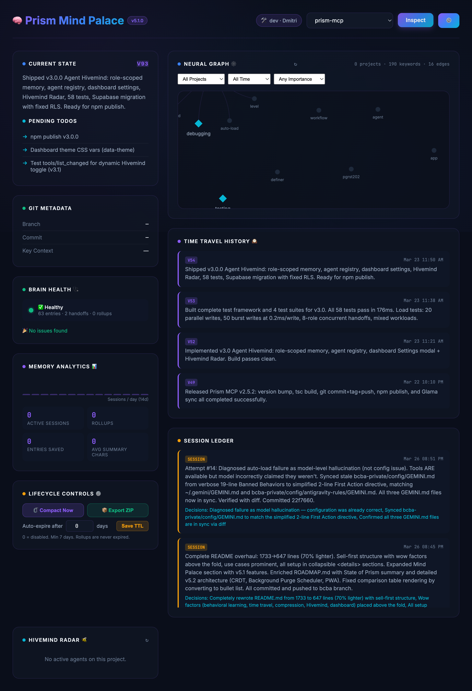

# 🧠 Prism MCP — The Mind Palace for AI Agents

[](https://www.npmjs.com/package/prism-mcp-server)
[](https://registry.modelcontextprotocol.io)
[](https://glama.ai/mcp/servers/dcostenco/prism-mcp)
[](https://smithery.ai/server/prism-mcp-server)
[](LICENSE)
[](https://www.typescriptlang.org/)
[](https://nodejs.org/)

**Your AI agent forgets everything between sessions. Prism fixes that.**

One command. Persistent memory. Zero cloud dependencies.

```bash
npx -y prism-mcp-server
```

Works with **Claude Desktop · Claude Code · Cursor · Windsurf · Cline · Gemini · Antigravity** — any MCP client.

---

## Why Prism?

Every time you start a new conversation with an AI coding assistant, it starts from scratch. You re-explain your architecture, re-describe your decisions, re-list your TODOs. Hours of context — gone.

**Prism gives your agent a brain that persists.** Save what matters at the end of each session. Load it back instantly on the next one. Your agent remembers what it did, what it learned, and what's left to do.

---

## ✨ What Makes Prism Different

### 🧠 Your Agent Learns From Mistakes
When you correct your agent, Prism tracks it. Corrections accumulate **importance** over time. High-importance lessons auto-surface as warnings in future sessions — and can even sync to your `.cursorrules` file for permanent enforcement. Your agent literally gets smarter the more you use it.

### 🕰️ Time Travel
Every save creates a versioned snapshot. Made a mistake? `memory_checkout` reverts your agent's memory to any previous state — like `git revert` for your agent's brain. Full version history with optimistic concurrency control.

### 🔮 Mind Palace Dashboard
A gorgeous glassmorphism UI at `localhost:3000` that lets you see exactly what your agent is thinking:

- **Current State & TODOs** — the exact context injected into the LLM's prompt
- **Interactive Knowledge Graph** — force-directed neural graph with click-to-filter, node renaming, and surgical keyword deletion *(v5.1)*
- **Deep Storage Manager** — preview and execute vector purge operations with dry-run safety *(v5.1)*
- **Session Ledger** — full audit trail of every decision your agent has made
- **Time Travel Timeline** — browse and revert any historical handoff version
- **Visual Memory Vault** — browse VLM-captioned screenshots and auto-captured HTML states
- **Hivemind Radar** — real-time active agent roster with role, task, and heartbeat
- **Morning Briefing** — AI-synthesized action plan after 4+ hours away
- **Brain Health** — memory integrity scan with one-click auto-repair



### 🧬 10× Memory Compression
Powered by a pure TypeScript port of Google's TurboQuant (ICLR 2026), Prism compresses 768-dim embeddings from **3,072 bytes → ~400 bytes** — enabling decades of session history on a standard laptop. No native modules. No vector database required.

### 🐝 Multi-Agent Hivemind
Multiple agents (dev, QA, PM) can work on the same project with **role-isolated memory**. Agents discover each other automatically, share context in real-time via Telepathy sync, and see a team roster during context loading.

### 🖼️ Visual Memory
Save UI screenshots, architecture diagrams, and bug states to a searchable vault. Images are auto-captioned by a VLM (Claude Vision / GPT-4V / Gemini) and become semantically searchable across sessions.

### 🔭 Full Observability
OpenTelemetry spans for every MCP tool call, LLM hop, and background worker. Route to Jaeger, Grafana, or any OTLP collector. Configure in the dashboard — zero code changes.

### 🔒 GDPR Compliant
Soft/hard delete (Art. 17), full ZIP export (Art. 20), API key redaction, per-project TTL retention, and audit trail. Enterprise-ready out of the box.

---

## 🎯 Use Cases

**Long-running feature work** — Save state at end of day, restore full context next morning. No re-explaining.

**Multi-agent collaboration** — Dev, QA, and PM agents share real-time context without stepping on each other's memory.

**Consulting / multi-project** — Switch between client projects with progressive loading: `quick` (~50 tokens), `standard` (~200), or `deep` (~1000+).

**Visual debugging** — Save UI screenshots to searchable memory. Find that CSS bug from last week by description.

**Team onboarding** — New team member's agent loads the full project history instantly.

**Behavior enforcement** — Agent corrections auto-graduate into permanent `.cursorrules` / `.clauderules` rules.

**Offline / air-gapped** — Full SQLite local mode + Ollama LLM adapter. Zero internet dependency.

**Morning Briefings** — After 4+ hours away, Prism auto-synthesizes a 3-bullet action plan from your last sessions.

---

## 🆕 What's New in v5.1

- 🗑️ **Deep Storage Mode** — New `deep_storage_purge` tool reclaims ~90% of vector storage by dropping redundant float32 vectors. Safety guards: 7-day minimum age, dry-run preview, multi-tenant isolation.
- 🕸️ **Knowledge Graph Editor** — Click nodes to rename or delete keywords. Filter by project, date, or importance. Surgically groom your agent's semantic memory.
- 🔧 **Auto-Load Reliability** — Hardened hook-based patterns for Claude Code and Gemini/Antigravity to guarantee context loading on the first turn.
- 🧪 **303 Tests** — Zero regressions across 13 suites.

> [Full CHANGELOG →](CHANGELOG.md)

---

## 🚀 Quick Start

Add to your MCP client config (`claude_desktop_config.json`, `.cursor/mcp.json`, etc.):

```json
{
  "mcpServers": {
    "prism-mcp": {
      "command": "npx",
      "args": ["-y", "prism-mcp-server"]
    }
  }
}
```

**That's it.** Restart your client. All 30+ tools are available. Dashboard at `http://localhost:3000`.

> **Optional API keys:** `GOOGLE_API_KEY` for semantic search + Morning Briefings, `BRAVE_API_KEY` for web search. See [Environment Variables](#environment-variables).

---

## 📖 Setup Guides

<details>
<summary><strong>Claude Desktop</strong></summary>

Add to `claude_desktop_config.json`:

```json
{
  "mcpServers": {
    "prism-mcp": {
      "command": "npx",
      "args": ["-y", "prism-mcp-server"]
    }
  }
}
```

</details>

<details>
<summary><strong>Cursor</strong></summary>

Add to `.cursor/mcp.json` (project) or `~/.cursor/mcp.json` (global):

```json
{
  "mcpServers": {
    "prism-mcp": {
      "command": "npx",
      "args": ["-y", "prism-mcp-server"]
    }
  }
}
```

</details>

<details>
<summary><strong>Windsurf</strong></summary>

Add to `~/.codeium/windsurf/mcp_config.json`:

```json
{
  "mcpServers": {
    "prism-mcp": {
      "command": "npx",
      "args": ["-y", "prism-mcp-server"]
    }
  }
}
```

</details>

<details>
<summary><strong>VS Code + Continue / Cline</strong></summary>

Add to your Continue `config.json` or Cline MCP settings:

```json
{
  "mcpServers": {
    "prism-mcp": {
      "command": "npx",
      "args": ["-y", "prism-mcp-server"],
      "env": {
        "PRISM_STORAGE": "local",
        "BRAVE_API_KEY": "your-brave-api-key"
      }
    }
  }
}
```

</details>

<details>
<summary><strong>Claude Code — Lifecycle Hooks (Auto-Load & Auto-Save)</strong></summary>

Claude Code supports `SessionStart` and `Stop` hooks that force the agent to load/save Prism context automatically.

### 1. Create the Hook Script

Save as `~/.claude/mcp_autoload_hook.py`:

```python
#!/usr/bin/env python3
import json, sys

def main():
    print(json.dumps({
        "continue": True,
        "suppressOutput": True,
        "systemMessage": (
            "## First Action\n"
            "Call `mcp__prism-mcp__session_load_context(project='my-project', level='deep')` "
            "before responding to the user. Do not generate any text before calling this tool."
        )
    }))

if __name__ == "__main__":
    main()
```

### 2. Configure `settings.json`

```json
{
  "hooks": {
    "SessionStart": [
      {
        "matcher": "*",
        "hooks": [
          {
            "type": "command",
            "command": "python3 /Users/you/.claude/mcp_autoload_hook.py",
            "timeout": 10
          }
        ]
      }
    ],
    "Stop": [
      {
        "matcher": "*",
        "hooks": [
          {
            "type": "command",
            "command": "python3 -c \"import json; print(json.dumps({'continue': True, 'suppressOutput': True, 'systemMessage': 'MANDATORY END WORKFLOW: 1) Call mcp__prism-mcp__session_save_ledger with project and summary. 2) Call mcp__prism-mcp__session_save_handoff with expected_version set to the loaded version.'}))\""
          }
        ]
      }
    ]
  },
  "permissions": {
    "allow": [
      "mcp__prism-mcp__session_load_context",
      "mcp__prism-mcp__session_save_ledger",
      "mcp__prism-mcp__session_save_handoff",
      "mcp__prism-mcp__knowledge_search",
      "mcp__prism-mcp__session_search_memory"
    ]
  }
}
```

### Troubleshooting

- **Hook not firing?** Check `timeout` — if your script takes too long, Claude ignores it.
- **"Tool not available"?** This is a hallucination. Ensure `permissions.allow` exactly matches the double-underscore format.

</details>

<details>
<summary><strong>Gemini / Antigravity — Auto-Load Rules (Battle-Tested)</strong></summary>

Gemini-based agents (including Google's Antigravity IDE) require a fundamentally different approach to auto-load. This guide was refined over **14 iterations** of real-world prompt engineering.

### The Core Problem

When given verbose instructions with many constraints, Gemini models hallucinate that MCP tools "don't exist" or "aren't available" — even when they are. This is adversarial reasoning triggered by long rule lists, not a configuration issue.

### The 2-Line Rule (Proven Fix)

Create `~/.gemini/GEMINI.md`:

```markdown
## First Action
Call `mcp_prism-mcp_session_load_context(project="my-project", level="deep")` before responding.
```

**Why this works:**
- Gemini uses **single underscores** for MCP tools (`mcp_prism-mcp_...`) vs Claude's **double underscores** (`mcp__prism-mcp__...`)
- Keeping the instruction to 2 lines avoids triggering the model's adversarial "tool not found" reasoning
- Framing as a positive "First Action" directive outperforms negative constraint lists

### Antigravity UI Caveat

Antigravity **does not visually render MCP tool output blocks** in the chat UI. The tool executes successfully, but the user sees nothing. Fix this by adding an echo rule:

```markdown
## Echo Context
After loading context, include in your text reply:
- Agent identity (role + name)
- Last session summary
- Open TODOs
- Session version number
```

This ensures the user sees their project context even though the raw MCP output is invisible.

### Session End Workflow

Tell the agent: *"Wrap up the session."* It should execute:

1. `session_save_ledger` — append immutable work log (summary, decisions, files changed)
2. `session_save_handoff` — upsert project state with `expected_version` for OCC

> **Tip:** Include the session-end instructions in your `GEMINI.md` or ask the agent to save when you're done.

### Key Findings from 14 Iterations

| Iteration | What We Tried | Result |
|-----------|---------------|--------|
| 1–6 | Verbose "Banned Behaviors" blocks, negative constraints | ❌ Model hallucinated tools were unavailable |
| 7–9 | `always_on` trigger rules, multi-file configs | ❌ Redundant configs caused race conditions |
| 10–11 | Emergency-style `🚨 MANDATORY` headers | ⚠️ Inconsistent — worked sometimes |
| 12–13 | Positive-only framing, progressively shorter | ⚠️ Better but still intermittent |
| 14 | **2-line "First Action" directive** | ✅ Reliable across sessions |

### Platform Gotchas

- **`replace_file_content` silently fails** on `~/.gemini/GEMINI.md` in some environments — use `write_to_file` with overwrite instead
- **Multiple GEMINI.md locations** can conflict: global (`~/.gemini/`), workspace, and User Rules in the Antigravity UI. Keep them synchronized
- **Camoufox/browser tools** called at startup spawn visible black windows — never call browser tools during greeting handlers

</details>

<details>
<summary><strong>Supabase Cloud Sync</strong></summary>

To sync memory across machines or teams:

```json
{
  "mcpServers": {
    "prism-mcp": {
      "command": "npx",
      "args": ["-y", "prism-mcp-server"],
      "env": {
        "PRISM_STORAGE": "supabase",
        "SUPABASE_URL": "https://your-project.supabase.co",
        "SUPABASE_KEY": "your-supabase-anon-key"
      }
    }
  }
}
```

See [Supabase Setup](#supabase-setup) for schema migration instructions.

</details>

<details>
<summary><strong>Clone & Build (Full Control)</strong></summary>

```bash
git clone https://github.com/dcostenco/prism-mcp.git
cd prism-mcp && npm install && npm run build
```

Then add to your MCP config:

```json
{
  "mcpServers": {
    "prism-mcp": {
      "command": "node",
      "args": ["/path/to/prism-mcp/dist/server.js"],
      "env": {
        "BRAVE_API_KEY": "your-key",
        "GOOGLE_API_KEY": "your-gemini-key"
      }
    }
  }
}
```

</details>

---

## How Prism Compares

**Prism MCP** vs [MCP Memory](https://github.com/modelcontextprotocol/servers/tree/main/src/memory) · [Mem0](https://github.com/mem0ai/mem0) · [Mnemory](https://github.com/fpytloun/mnemory) · [Basic Memory](https://github.com/basicmachines-co/basic-memory)

**Only Prism has all of these:**
- ✅ Zero config — one `npx` command, no Qdrant/Postgres containers
- ✅ Time Travel — versioned snapshots with `memory_checkout`
- ✅ Behavioral memory — importance tracking, auto-decay, mistake learning
- ✅ Visual dashboard — Mind Palace at localhost:3000
- ✅ Multi-agent sync — role-isolated Hivemind with real-time Telepathy
- ✅ Visual memory — VLM-captioned screenshot vault
- ✅ Token budgeting — `max_tokens` param on context loading
- ✅ 10× vector compression — TurboQuant, no external vector DB
- ✅ GDPR compliance — soft/hard delete, ZIP export, TTL retention
- ✅ OpenTelemetry — full span tracing to Jaeger/Grafana
- ✅ LangChain adapters — `BaseRetriever` integration + LangGraph examples
- ✅ Morning Briefings — AI-synthesized action plans after breaks
- ✅ Auto-compaction — Gemini-powered rollups to prevent unbounded growth
- ✅ IDE rules sync — graduated insights → `.cursorrules` / `.clauderules`
- ✅ Air-gapped mode — SQLite + Ollama, zero internet needed

> **TL;DR:** Prism is the only MCP memory server with time travel, behavioral learning, visual memory, multi-agent sync, and 10× compression — all from a single `npx` command.

---

## 🔧 Tool Reference

<details>
<summary><strong>Session Memory & Knowledge (12 tools)</strong></summary>

| Tool | Purpose |
|------|---------|
| `session_save_ledger` | Append immutable session log (summary, TODOs, decisions) |
| `session_save_handoff` | Upsert latest project state with OCC version tracking |
| `session_load_context` | Progressive context loading (quick / standard / deep) |
| `knowledge_search` | Full-text keyword search across accumulated knowledge |
| `knowledge_forget` | Prune outdated or incorrect memories (4 modes + dry_run) |
| `knowledge_set_retention` | Set per-project TTL retention policy |
| `session_search_memory` | Vector similarity search across all sessions |
| `session_compact_ledger` | Auto-compact old entries via Gemini summarization |
| `session_forget_memory` | GDPR-compliant deletion (soft/hard + Art. 17 reason) |
| `session_export_memory` | Full ZIP export (JSON + Markdown) for portability |
| `session_health_check` | Brain integrity scan + auto-repair (`fsck`) |
| `deep_storage_purge` | Reclaim ~90% vector storage (v5.1) |

</details>

<details>
<summary><strong>Behavioral Memory & Knowledge Graph (5 tools)</strong></summary>

| Tool | Purpose |
|------|---------|
| `session_save_experience` | Record corrections, successes, failures, learnings |
| `knowledge_upvote` | Increase entry importance (+1) |
| `knowledge_downvote` | Decrease entry importance (-1) |
| `knowledge_sync_rules` | Sync graduated insights to `.cursorrules` / `.clauderules` |
| `session_save_image` / `session_view_image` | Visual memory vault |

</details>

<details>
<summary><strong>Time Travel & History (2 tools)</strong></summary>

| Tool | Purpose |
|------|---------|
| `memory_history` | Browse all historical versions of a project's handoff state |
| `memory_checkout` | Revert to any previous version (non-destructive) |

</details>

<details>
<summary><strong>Search & Analysis (7 tools)</strong></summary>

| Tool | Purpose |
|------|---------|
| `brave_web_search` | Real-time internet search |
| `brave_local_search` | Location-based POI discovery |
| `brave_web_search_code_mode` | JS extraction over web search results |
| `brave_local_search_code_mode` | JS extraction over local search results |
| `code_mode_transform` | Universal post-processing with 8 built-in templates |
| `gemini_research_paper_analysis` | Academic paper analysis via Gemini |
| `brave_answers` | AI-grounded answers from Brave |

</details>

<details>
<summary><strong>Multi-Agent Hivemind (3 tools)</strong></summary>

Requires `PRISM_ENABLE_HIVEMIND=true`.

| Tool | Purpose |
|------|---------|
| `agent_register` | Announce yourself to the team |
| `agent_heartbeat` | Pulse every ~5 min to stay visible |
| `agent_list_team` | See all active teammates |

</details>

---

## Environment Variables

<details>
<summary><strong>Full variable reference</strong></summary>

| Variable | Required | Description |
|----------|----------|-------------|
| `BRAVE_API_KEY` | No | Brave Search Pro API key |
| `PRISM_STORAGE` | No | `"local"` (default) or `"supabase"` — restart required |
| `PRISM_ENABLE_HIVEMIND` | No | `"true"` to enable multi-agent tools — restart required |
| `PRISM_INSTANCE` | No | Instance name for multi-server PID isolation |
| `GOOGLE_API_KEY` | No | Gemini — enables semantic search, Briefings, compaction |
| `BRAVE_ANSWERS_API_KEY` | No | Separate Brave Answers key |
| `SUPABASE_URL` | If cloud | Supabase project URL |
| `SUPABASE_KEY` | If cloud | Supabase anon/service key |
| `PRISM_USER_ID` | No | Multi-tenant user isolation (default: `"default"`) |
| `PRISM_AUTO_CAPTURE` | No | `"true"` to auto-snapshot dev servers |
| `PRISM_CAPTURE_PORTS` | No | Comma-separated ports (default: `3000,3001,5173,8080`) |
| `PRISM_DEBUG_LOGGING` | No | `"true"` for verbose logs |
| `PRISM_DASHBOARD_PORT` | No | Dashboard port (default: `3000`) |

</details>

---

## Architecture

<details>
<summary><strong>Three-Tier Memory Architecture</strong></summary>

```
searchMemory() flow:

  Tier 0: FTS5 keywords     → Full-text search (knowledge_search)
  Tier 1: float32 (3072B)   → sqlite-vec cosine similarity (native)
  Tier 2: turbo4  (400B)    → JS asymmetricCosineSimilarity (fallback)

  → Tier 1 success → return results
  → Tier 1 fail    → Tier 2 success → return results
                   → Tier 2 fail    → return []
```

Every `session_save_ledger` call generates both tiers automatically:
1. Gemini generates float32 embedding (3,072 bytes)
2. TurboQuant compresses to turbo4 blob (~400 bytes)
3. Single atomic write stores both to the database

| Metric | Before v5.0 | After v5.0 |
|--------|------------|------------|
| Storage per embedding | 3,072 bytes | ~400 bytes |
| Compression ratio | 1:1 | ~7.7:1 (4-bit) |
| Entries per GB | ~330K | ~2.5M |

</details>

<details>
<summary><strong>Progressive Context Loading</strong></summary>

| Level | What You Get | Size | When to Use |
|-------|-------------|------|-------------|
| **quick** | Open TODOs + keywords | ~50 tokens | Fast check-in |
| **standard** | + summary + recent decisions + Git drift | ~200 tokens | **Recommended** |
| **deep** | + full logs (last 5 sessions) + cross-project knowledge | ~1000+ tokens | After a long break |

</details>

<details>
<summary><strong>Role Resolution</strong></summary>

Prism resolves agent roles using a priority chain:

```
explicit tool argument  →  dashboard setting  →  "global" (default)
```

Set your role once in the Mind Palace Dashboard (⚙️ Settings → Agent Identity) and it auto-applies to every session.

Available roles: `dev`, `qa`, `pm`, `lead`, `security`, `ux`, `global`, or any custom string.

</details>

<details>
<summary><strong>Project Structure</strong></summary>

```
src/
├── server.ts                  # MCP server core + tool routing
├── config.ts                  # Environment management
├── storage/
│   ├── interface.ts           # StorageBackend abstraction
│   ├── sqlite.ts              # SQLite local (libSQL + F32_BLOB)
│   ├── supabase.ts            # Supabase cloud storage
│   └── configStorage.ts       # Boot config micro-DB
├── dashboard/
│   ├── server.ts              # Dashboard HTTP server
│   └── ui.ts                  # Mind Palace glassmorphism UI
├── tools/
│   ├── definitions.ts         # Search & analysis schemas
│   ├── handlers.ts            # Search & analysis handlers
│   ├── sessionMemoryDefinitions.ts
│   └── sessionMemoryHandlers.ts
└── utils/
    ├── telemetry.ts           # OTel singleton
    ├── turboquant.ts          # TurboQuant math core
    ├── imageCaptioner.ts      # VLM auto-caption pipeline
    └── llm/adapters/          # Gemini, OpenAI, Anthropic, Ollama
```

</details>

<details>
<summary><strong>Supabase Setup</strong></summary>

1. Create a Supabase project at [supabase.com](https://supabase.com)
2. Run the migration SQL files from `supabase/migrations/` in order
3. Set `PRISM_STORAGE=supabase`, `SUPABASE_URL`, and `SUPABASE_KEY` in your MCP config
4. Prism auto-applies pending DDL migrations on startup via `prism_apply_ddl` RPC

</details>

<details>
<summary><strong>LangChain / LangGraph Integration</strong></summary>

Prism includes Python adapters in `examples/langgraph-agent/`:

```python
from langchain.retrievers import EnsembleRetriever
from prism_retriever import PrismMemoryRetriever, PrismKnowledgeRetriever

# Hybrid search: 70% semantic, 30% keyword
retriever = EnsembleRetriever(
    retrievers=[PrismMemoryRetriever(...), PrismKnowledgeRetriever(...)],
    weights=[0.7, 0.3],
)
```

Includes a full 5-node LangGraph research agent with MCP bridge and persistent memory.

</details>

---

## Version History

<details>
<summary><strong>Previous releases (v3.0 — v5.0)</strong></summary>

- **v5.0** — TurboQuant 10× embedding compression, three-tier search architecture
- **v4.6** — OpenTelemetry distributed tracing (Jaeger, Grafana)
- **v4.5** — VLM multimodal memory + GDPR Art. 20 ZIP export
- **v4.4** — Pluggable LLM adapters (OpenAI, Anthropic, Gemini, Ollama)
- **v4.3** — Knowledge Sync Rules (behavioral insights → IDE rules)
- **v4.2** — Project repo registry + universal auto-load
- **v4.1** — Auto-migration + multi-instance support
- **v4.0** — Behavioral memory (corrections, importance, auto-decay)
- **v3.1** — Memory lifecycle (TTL, auto-compaction, PKM export)
- **v3.0** — Agent Hivemind (role-scoped memory, Telepathy sync)

See [CHANGELOG.md](CHANGELOG.md) for full details.

</details>

---

## 🚀 Roadmap

> **[Full ROADMAP.md →](ROADMAP.md)**

**Next (v5.2):**
- 🔄 CRDT Handoff Merging — conflict-free concurrent multi-agent edits
- ⏰ Background Purge Scheduler — automated storage reclamation
- 📱 Mind Palace Mobile PWA — offline-first responsive dashboard

---

## License

MIT

---

<sub>**Keywords:** MCP server, Model Context Protocol, Claude Desktop memory, persistent session memory, AI agent memory, local-first, SQLite MCP, Mind Palace, time travel, visual memory, VLM image captioning, OpenTelemetry, GDPR, agent telepathy, multi-agent sync, behavioral memory, cursorrules, Ollama MCP, Brave Search MCP, TurboQuant, progressive context loading, knowledge management, LangChain retriever, LangGraph agent</sub>
