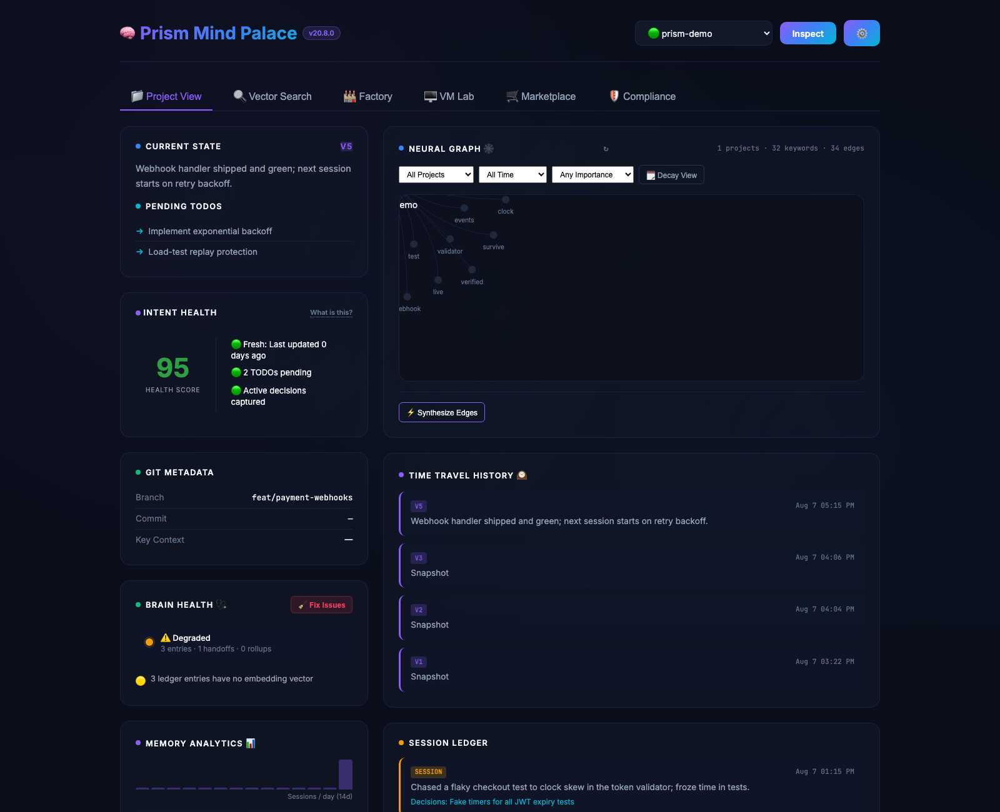
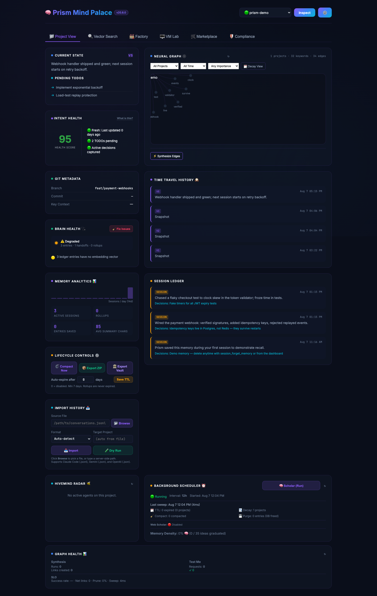
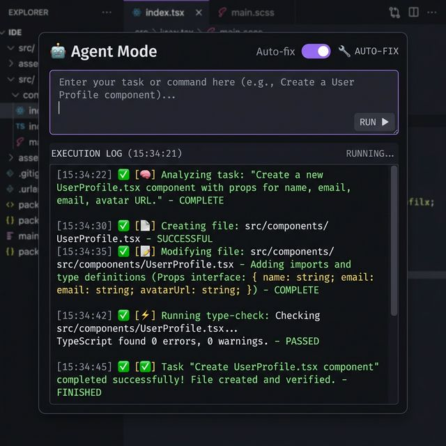
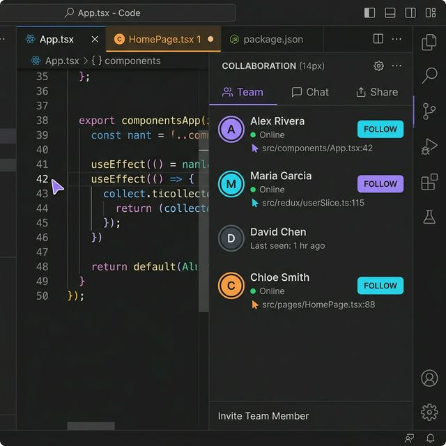

# Prism Coder

**Give your AI agent memory that lasts.** Persistent sessions, knowledge graphs, and offline tool-routing — fully local and free.

[](https://www.npmjs.com/package/prism-mcp-server)
[](https://github.com/modelcontextprotocol/servers)
[](LICENSE)
[](https://huggingface.co/dcostenco)

<p align="center">
  
</p>

Prism Coder is an [MCP server](https://modelcontextprotocol.io) that gives Claude, Cursor, and other AI tools long-term memory that survives across sessions. It ships with the open-weight `prism-coder` model fleet (2B–27B) for fast, offline tool-routing — no cloud required.

**No account needed. No API keys. Runs on your machine.**  
A paid subscription adds cloud sync, higher model tiers, and team features through the [Synalux portal](https://synalux.ai).

---

## What Prism gives you

- **Session memory that survives restarts** — resume projects with handoff notes,
  recent work, open TODOs, and configurable quick, standard, or deep context.
- **Local-first inference** — bounded work is routed through local Ollama models
  first, with automatic 2B/4B/9B/27B selection based on installed models,
  available RAM, context fit, and subscription entitlements.
- **Route-output enforcement** — route mode returns only well-formed calls to
  tools the host actually advertised. Standard and higher plans can add
  authenticated deterministic correction; `route_guard: "local"` keeps the
  prompt and draft entirely on-device.
- **One setup for every agent** — `prism connect` configures Claude Code,
  Claude Desktop, Cursor, Gemini CLI, and Codex while preserving unrelated
  settings.
- **Subscription-aware skills** — entitled skills are synchronized before the
  host launches, with safe upgrades, downgrades, conflict preservation, and
  offline last-good recovery.
- **Hook-free startup** — MCP metadata and native instructions request Prism's
  startup context without requiring lifecycle hooks or a Prism-owned launcher.
- **Safe escalation and observability** — inference outcomes are explicit,
  reserved content remains fail-closed, and local/cloud usage is recorded for
  review.

## Get started

```bash
npm install -g prism-mcp-server
prism connect
```

Use `prism connect --dry-run` to preview changes, `prism connect --all` to
configure every detected host, or `prism connect --refresh` to reconcile
Prism-managed entries after an upgrade. Restart the host after connecting.

Prism works locally without an account, API key, or cloud subscription. Add a
Synalux subscription when you want cloud memory, paid-tier skills, or team
features.

### Install as a plugin

Prism also ships as a plugin, which registers the MCP server and the startup
skill for you.

**Claude Code** — from the community marketplace:

```bash
/plugin marketplace add anthropics/claude-plugins-community
/plugin install synalux-prism@claude-community
```

**Codex** — this repository is itself a plugin marketplace:

```bash
codex plugin marketplace add dcostenco/prism-coder
codex plugin add synalux-prism@prism
```

The plugin registers `prism-mcp` via `npx -y prism-mcp-server`. If you already
configured Prism by hand — `prism connect` writes an `mcp_servers.prism-mcp`
entry — you have that server twice under one key. Install the plugin **or**
run `prism connect`, not both.

### What `prism connect` changes about host subagents

`connect` steers bounded work to `prism_infer` on your machine rather than to
host-spawned agents. What it writes differs per host, and **it does not disable
subagents everywhere** — Claude Code keeps them and is pointed at an economy
model instead. Prism's local workers stay available over MCP in every case.

| Host | Setting written | Effect |
|---|---|---|
| Claude Code | `env.CLAUDE_CODE_SUBAGENT_MODEL = "sonnet"` in `~/.claude/settings.json` | Subagents stay **enabled**, pinned to an economy model. Fan-out is discouraged by policy text, not by config |
| Gemini CLI | `experimental.enableAgents = false` in `~/.gemini/settings.json` | Subagents **off**. Gemini exposes one boolean, so that is all there is to set |
| Codex | `features.multi_agent = false` in `$CODEX_HOME/config.toml` (default `~/.codex`), plus a bounded fallback: 2 threads, depth 1, cheap subagent model, 900s cap | Subagents **off**, with a bounded profile underneath so a deliberate re-enable lands somewhere sane |

Two things worth knowing:

- **`experimental` is Gemini's namespace, not ours.** Prism is not enabling
  anything experimental — it writes `false` to a flag Gemini already defines at
  that path. Writing anywhere else would have no effect.
- **That namespace is by definition temporary.** If Gemini promotes
  `enableAgents` out of `experimental`, Prism keeps writing the old path, Gemini
  reads the new one, and host subagents quietly turn back on. Nothing errors and
  the settings file still looks correct. If you see host subagents running while
  `enableAgents` reads `false`, check whether the key has moved before assuming
  `connect` failed to write it.

Both writes are idempotent in the sense that a host already configured this way
is left untouched — but they are **re-applied on every `prism connect` run**,
not only on `--refresh`. If you deliberately re-enable host subagents, the next
`connect` will turn them off again. Keep them on by not re-running `connect`,
or by re-enabling after each run.

---

<details>
<summary>Release history (optional)</summary>

## What's New in v20.12.1

- **`prism connect --refresh` now converges every registration it owns**, not
  just the top-level one — directory-scoped entries could otherwise keep
  launching an old build indefinitely.
- **`prism update` checks the installed package**, not the CLI that happens to
  be running, so it can no longer report "current" while the install is stale.
- **The opt-in scheduled updater can actually start** — the LaunchAgent now
  carries a PATH that includes node and npm.

## What's New in v20.12.0

- **Prism now tells you when it's out of date.** Session startup shows a
  one-line update notice when a newer release exists — cache-backed, at most
  one registry check per day, silent offline. `PRISM_NO_UPDATE_CHECK=1`
  opts out.
- **Hands-free updates, if you want them.** `prism autoupdate enable` sets up
  a daily `prism update --if-idle`: it updates only the global npm package,
  defers while any Prism server is running, and never touches host
  configuration — that stays behind a visible `prism connect`.

## What's New in v20.11.1

- **Saving memory never gets refused.** The save path used to reject
  `session_save_ledger`/`save_handoff` calls when its path-to-project
  heuristic disagreed with the project you declared — and the registry the
  heuristic trusted could contain junk from earlier auto-registration, so
  legitimate sessions ended unsaved. Your declaration now always wins; the
  disagreement is returned as an advisory warning, and auto-registration
  only accepts real repository roots.
- **Screenshots are evidence again.** `prism browser` captures on macOS were
  silently *upscaled* to the size cap, so a screenshot no longer showed what
  actually rendered. Only genuinely oversized captures are resized now, and
  the cap no longer clips a standard 1920-wide viewport.

## What's New in v20.10.0 – v20.11.0

- **Skill routing now works mid-session.** New prompts are matched on-device
  as the conversation moves — not just on turn one — and injected within each
  host's real context limits (Claude Code caps hook output at 10k chars;
  Codex truncates by default), with pointer-first delivery when a payload
  can't fit inline.
- **`prism connect` is a converge command.** It self-updates first, re-execs,
  then reconciles MCP registration, skills, and hooks — no more
  "fresh config, stale code" machines.
- **Scoped skills route on prompts too**, and startup output survives hosts
  that discard structured tool content.

## What's New in v20.9.0 – v20.9.3

- **Your skills follow your account.** `skill_save` stores a skill at the
  scope you choose: this machine only (`local`, works offline and signed out),
  your account (`user` — every machine you sign into receives it), or a
  workspace (`team` — shared with members, admin-managed, optionally targeted
  to specific people).
- **Trim the catalog you don't use.** `skill_manage` can release platform
  skills you never touch — freeing host skill-catalog budget — and restore
  them any time, losslessly. Deleting a scoped skill archives its final
  content locally first, so nothing is ever silently unrecoverable.

- **Delivery that queues instead of failing.** Concurrent sessions no longer
  starve skill sync on the local config store (WAL + busy-timeout) — a failure
  that previously reported only "partial" where nobody could see it.
- **Withheld rules still bind.** When the context budget can't inline a
  skill's text, the manifest of withheld names now states that those skills
  still govern the work and names every way to load them before completion
  claims.
- **The budget the floor never spent.** A long-standing accounting bug meant
  no unprotected skill ever inlined at any normal context level — the
  always-inlined protected floor was debiting the budget meant for everything
  else. Task-matched skills (like the completion-evidence checklist) now
  actually arrive.

## What's New in v20.8.2

- **Skill delivery now admits failure instead of hiding it.** A filesystem
  permission edge case (a umask stripping the owner-execute bit) could leave
  skill sync writing nothing while reporting itself current — measured at nine
  days on a real machine. Broken managed directories are repaired in place,
  every directory is created umask-proof, and the repair path refuses symlinks
  via an `O_NOFOLLOW` descriptor.
- **A stale install tells you at startup.** Prism now tracks the generation
  that actually reached disk separately from the one the database accepted; if
  they diverge, the startup banner says so in a warning placed where display
  truncation cannot cut it. A successful sync clears it automatically.

## What's New in v20.7 – v20.8.0

- **First run proves the memory instead of describing it** — `session_bootstrap`
  seeds one demo memory and shows it *recalled from disk*, so the save→recall
  loop is felt in session 1. One-shot, contained in its own `prism-demo`
  project, removable with one call.
- **Dashboard fixed** — a quoting typo (shipped 2026-05-29) killed the inline
  script at parse time, so every dashboard since rendered "Loading projects..."
  forever. Fixed, and the ES5 lint now `node --check`s the built inline script
  so an unparseable dashboard can never ship again.
- **Trusted Publishing** — npm releases authenticate via GitHub OIDC. No stored
  token to expire or leak, and every release carries a signed [provenance
  attestation](https://docs.npmjs.com/generating-provenance-statements) — you
  can verify the tarball you install was built from this repo by CI
  (`npm audit signatures`).
- **TLS enforced for cloud sync** — a remote `http://` storage URL is upgraded
  to `https://` instead of silently sending session content in the clear.
- **Codex plugin collision + enabled-state detection** — `prism connect` skips
  its own registration only when a plugin *actually* provides `prism-mcp`
  (cache present **and** enabled), preventing both duplicate and missing
  servers.
- Windows CI stabilized; registry/npm listings realigned and deduplicated.

## What's New in v20.6.0

### Delivery Is Not a Suggestion

An audit of a real incident (an agent wiped demo data after *announcing* the
wipe — with the ask-first rule committed, bundled, and absent from what any
agent actually received) found the protected floor had outgrown every delivery
budget: "unprotected" had quietly come to mean "never delivered".

- **`ask-first` and `feature-preservation` join the protected floor** (14 → 16).
  Protected skills are always inlined; these two now reach every session.
- **Sync conflicts are loud and named.** Startup used to say "· 2 local
  conflicts preserved" while safety skills sat months stale; it now names each
  frozen skill and states how to resume updates.
- **`--storage` accepts `auto` and `synalux`** — the CLI rejected its own
  documented default and the production backend.
- **Disclosure:** skill delivery informs; it does not gate. A live probe showed
  a host agent still edit unverified source with the rule loaded. If your
  threat model includes an agent acting against a loaded rule under task
  pressure, pair this package with mechanical gates (hooks, permissions,
  least-privilege roles). True of every prior release; stated from this one.

## What's New in v20.5.3

### Grounding Evidence Carries Its Age

Memory-grounded answers labelled their sources but never dated them, so a
two-year-old note and yesterday's reached the model identically. Nothing in the
evidence let it discount the stale one. Prompted by an external review naming
the right risk for local-first memory: *the data stays local, but bad grounding
becomes permanent* — storing everything on your machine removes the outside
pressure that would otherwise surface a stale note.

Evidence now reads:

```
[SOURCE 1: ledger:8286581d (recorded 2025-05-29, 431 days ago)]
```

The date already existed in storage and was being dropped at the snippet layer,
so this is plumbing rather than new data collection. Zone-less SQLite
timestamps are normalised to UTC — read as local, a ten-minute-old record
parsed hours into the future and its age was suppressed entirely, meaning the
feature silently did nothing on the freshest memories. An absent or unparseable
date renders as nothing rather than defaulting to now; defaulting would make
the oldest memories, the ones most likely to be stale, appear freshest.

`tests/integration/grounding-staleness.test.ts` runs the reviewer's own probe —
seed a deliberately outdated note beside a contradicting fresh one and assert
the model receives both, visibly dated. Anyone can run it.

**Not solved, and not claimed:** retrieval does not weight recency. A stale note
shown *beside* a fresh one is the easy case — the model sees both dates and can
weigh them. The hard case is a stale note retrieved *alone*, because ranking is
by keyword match and an old store returns old results; then the age label is the
only defence and there is no fresher record to compare against. Tracked as
`TECH_DEBT.md` #4.

## What's New in v20.5.0 – v20.5.2

### The First Message Never Leaves Your Machine

Symptom-triggered skills — the rules that fire on "can't see X", "no rows",
"the list is empty" — are meant to load on the turn an incident report arrives.
They never did: every host template called `session_bootstrap` with `{}`, so
there was no prompt to match against.

Fixing that raised the question of where matching happens. It now happens
locally. The 28 keyword rules are already public, so there was nothing a local
match could not compute, and `callPortal()` has no `prompt` parameter at all —
the guarantee is structural, not a promise. The portal request carries the
project and role only.

A matched rule now arrives as **content**, not as a name. Native hosts outside
the skill-file mirror had no way to read a rule they were only told about, so
the rule body is inlined into the startup display, bounded and sized against
the real per-project budget.

## What's New in v20.4.0

### An Explicitly Named Cloud Backend Fails Loud

Setting `PRISM_STORAGE=synalux` or `=supabase` with incomplete credentials used
to downgrade silently to local SQLite. The switch was logged to stderr, which
MCP hosts discard, so nothing surfaced it: sessions kept serving stale local
context while the cloud held newer history, and `context_source` read `local`
rather than any kind of warning. A session could run that way for weeks.

Naming a backend outright is a strong statement of intent, so it now throws —
naming the missing variables and the `PRISM_STORAGE=local` opt-out — instead of
quietly splitting your session history. `auto` is unchanged: it keeps its
documented `synalux > supabase > local` degradation, pinned by a test.

**Upgrade note:** if you explicitly set `PRISM_STORAGE=synalux|supabase` and
your credentials are incomplete, startup now fails with a named error instead
of silently using local data. That error is the fix — set the missing variable,
or choose `PRISM_STORAGE=local` deliberately. Default (`auto`) configs are
unaffected.

The throw is deliberately not treated as a recoverable startup fault: that path
exists for transient errors (rate limits, 5xx, DNS), which may degrade behind a
visible notice. A missing credential is a configuration fault and must not be
papered over.

Also: the skill block is now budgeted by default rather than only on request,
so a large skill payload cannot crowd out briefing and history.

## What's New in v20.3.2

### Web Scholar: SSRF Hardening

Security release. Web Scholar scrapes article URLs that come from
search-engine output, so the target is attacker-influenceable through SEO
poisoning — and because what it scrapes is written into the memory corpus and
passed to the configured LLM, a redirection to a local address meant reading an
internal service *and* sending the result onward.

The host guard matched string prefixes instead of parsing the address, and six
spellings of a local address got through: `[::1]` (`URL.hostname` keeps the
brackets), `127.0.0.2` (only `.1` was enumerated, not all of `127.0.0.0/8`),
`0.0.0.0`, `[::ffff:127.0.0.1]`, `localhost.` (a trailing dot defeated every
suffix check at once), and `[64:ff9b::7f00:1]` (NAT64 embeds IPv4 in its low
bits). Host classification now parses addresses and also covers CGNAT,
benchmarking, multicast, reserved, and IPv6 unique-local and link-local ranges.

DNS rebinding is closed too. Every check read the URL string, so a hostname the
attacker controls passed all of them and could still resolve to `127.0.0.1`.
Targets are now resolved first, every returned address is validated, and the
connection is pinned to those addresses so the name is never resolved a second
time — which also shuts the window between the check and the connect.

Scrape failures no longer vanish into a bare `catch {}`, a run is bounded by
`PRISM_SCHOLAR_SCRAPE_BUDGET_MS` (default 60s) instead of stalling on a raised
article count, and responses are capped at 8 MiB.

This is reachable only when scholar actually runs — `scholar_research`, or the
background loop under `PRISM_SCHOLAR_ENABLED=true` — and when the attacker also
controls DNS or a search result. Upgrade if you use Web Scholar.

---

## What's New in v20.3.1

### Prism Browser Reports Real Failures

`prism browser` could not fail a test. `eval 1 === 2` returned `status: ok`
with exit code 0, a page serving HTTP 500 reported `status: ok`, and console
errors and uncaught page exceptions were discarded entirely. This release adds
assertions — `assert-text`, `assert-visible`, `assert-count`, `assert-url`,
`assert-title`, `assert-eval`, `assert-no-page-errors` — that return
`status: failed` and a non-zero exit. `open` now reports `http_status` and
fails on 400 or higher, screenshots are validated rather than assumed, and
`eval` returns native JSON with its type instead of a Python `repr`.

The fingerprint layer had never been applied: a wrong keyword argument made
the stealth library throw on every launch — 1,139 failures and 0 successes
since April — while the runner reported it as active. It is fixed, and a layer
that cannot be applied now fails loudly. The headless build no longer
advertises itself through `navigator.userAgentData` or the `Sec-CH-UA` header,
and a patch that corrupted `Object.getOwnPropertyDescriptor` on every page
under test has been removed. These remain best-effort test aids, not a
guarantee against bot detection.

`--local-only` now actually isolates: WebSocket, EventSource, WebRTC and
`sendBeacon` egress bypass request routing and were never blocked, and service
workers were allowed through. `--cleanup` was a no-op in the two modes agents
use. Site isolation, phishing detection and popup blocking are no longer
disabled by default, since these profiles hold live authenticated cookies.

New for test runs: `--ephemeral-profile` and `--storage-state` for hermetic
authenticated flows, `pages`/`switch-page` so OAuth popups are reachable,
`--fail-fast`, `--fast`, `--trace`/`--video`/`--har`, and
`profiles --prune-older-than` for profile maintenance.

---

## What's New in v20.2.7

### Session Saves Survive Agent Restarts
Prism now remembers that a conversation successfully loaded its project context
when the MCP server restarts or another Prism process handles the next request.
`session_save_ledger` and `session_save_handoff` no longer fail with a false
`context_not_loaded` error in that flow.

The recovery remains fail-closed: authorization is limited to the exact project
and conversation, expires with the existing context window, and stores no
plaintext conversation identifier. Cross-project, forged, malformed, expired,
or future-dated receipts are still rejected. The release also updates PostCSS
to the patched 8.5.23 release.

---

## What's New in v20.3.0

### Hybrid Memory Search (Portal Tier)

`session_search_memory` on the portal tier (Synalux-backed installs) now
fuses semantic similarity with exact-term lexical matching via weighted
reciprocal-rank fusion. Measured on blind probes against a real
8.5k-entry corpus: fused retrieval was **never worse** than semantic
alone at top-5, and exact identifiers — TPNs, function names, error
strings — now rescue queries that embedding similarity blurs. Results say how they were found — `hybrid retrieval`
headers, per-hit `sem#/lex#` arms — and a lexical-only rescue is labelled
`exact-term match` instead of pretending to a similarity score. Local
SQLite installs keep pure vector search; hybrid needs the portal's
lexical index.

## What's New in v20.2.6

### Safer Configuration Updates Across Every Agent
`prism connect` now reads Claude, Cursor, Gemini, and Codex configuration
through a single verified file snapshot, preventing another process from
swapping a file between Prism's safety check and its read. Supported symlinked
dotfiles still work, while dangling or planted symlinks fail loudly instead of
being followed or overwritten. This release also carries the patched
dependencies and cross-platform release checks introduced in v20.2.5.

Cloud fallback is now documented consistently as Gemini 3.6 Flash. Plan
ceilings govern automatic `prism_infer` routing; direct use of any downloaded
model through local Ollama remains free on every tier.

---

## What's New in v20.2.4

### Reliable Session Memory That Shows Work, Not Greetings
Greeting-only assistant replies are skipped before ledger writes. Existing
greeting rows are filtered at read time across native startup, MCP context, and
`prism load --json`, while entries containing decisions, TODOs, changed files,
or non-session events remain visible. Historical rows are not destructively
deleted. If Synalux has a transient startup failure, Prism displays one bounded
local last-good snapshot and clearly labels it; permanent authorization or
validation failures still fail loud, and later writes remain cloud-routed.

---

## What's New in v20.2.2

### One Local-First Workflow Across Every Agent
`prism connect` now installs one orchestration contract for Claude Code,
Claude Desktop, Cursor, Gemini CLI, and Codex. Bounded delegated work goes to
`session_task_route` and the local `prism_infer` worker first; routine work must
not create background host agents. Local workers can receive the active
project's dashboard-configured quick, standard, or deep memory and select a
RAM-safe 2B/4B/9B/27B model at call time. The router forwards complexity but
does not choose the model; `prism_infer` owns the final decision using memory
and context fit, installed models, live RAM, entitlements, and explicit caller
overrides.

Codex and Gemini native agent fan-out are disabled during connect. Codex keeps
a two-thread, one-level Terra/low fallback profile if the developer explicitly
re-enables native agents later. Claude Code keeps native agents as a last-resort
path but pins their model to Sonnet. Cursor and Claude Desktop do not expose a
supported global subagent-policy file, so they receive the identical workflow
through Prism's MCP server instructions. `prism_infer` safety boundaries and
the host's final verification responsibility are unchanged.

### Subscription-Tier Skills Arrive Before the First Host Launch
`prism connect` now downloads the authoritative Synalux skill manifest and
materializes entitled packages in the native `~/.agents/skills` directory
before the command exits. Codex therefore sees the current skillset on its
first launch instead of requiring a second restart. Prism rechecks the same
snapshot at MCP startup, session load, and every five minutes—without host
lifecycle hooks.

On the first user turn, Prism's native skill, MCP metadata, and managed host
instructions request one `session_bootstrap({})` call. Prism then uses the
dashboard's developer name, Auto-Load Projects, and quick, standard, or deep
setting. The response stays focused on greeting and session state because tier
skills are already present in the host's native skill directory.

Hook-free MCP can provide and prioritize that ready-to-display block, but the
host model still owns the final assistant message and may summarize it. Prism
does not claim a deterministic verbatim greeting on third-party chat surfaces;
that would require a host lifecycle hook, launcher, extension, or Prism-owned
panel. Context loading itself remains complete even when a host shortens the
visible reply.

Free accounts receive only the public hook-free `prism-startup` package; the MCP
server still supplies a compact, non-proprietary safety and evidence contract.
Authenticated paid accounts receive the protected behavioral and engineering
packages plus the current subscribed routing set. The paid
`evidence-first-protocol` keeps ordinary coding lightweight: one correlated
reproduction is enough to begin an edit, while strict acceptance starts only
before a completion claim, push, or release and inspects only the exact artifacts
used as proof. Upgrades install newly entitled packages; verified downgrades
remove only Prism-owned packages while preserving local skills and locally
modified conflicts.

When upgrading an older Claude Code installation, `prism connect` removes only
the exact Prism-owned startup, skill-sync, handoff, and drift hook actions from
the legacy bootstrap. It also removes the recognized legacy Prism startup
sections from `~/CLAUDE.md`, preserves every other instruction, and installs a
small ownership-marked native block that selects `session_bootstrap({})` on the
first turn. User hooks, custom instruction sections, and near matches remain
untouched; native skills and server-side reminders preserve those Prism
features without host lifecycle hooks. Because hosts expose no native
session-end callback, handoff at shutdown is instruction-driven rather than a
guaranteed lifecycle event.

After Claude Code's native user registration succeeds, the same default or
`--refresh` command checks the nearest `.mcp.json` from the current directory
through the home directory. It removes only the exact legacy
`prism-mcp` entry `{ "command": "npx", "args": ["-y", "prism-mcp-server"] }`
that would otherwise shadow the user registration. Custom Prism entries and
their additional fields, plus unrelated servers, are preserved; malformed
files fail loud without changes. `--dry-run` reports the recognized migration
without changing the file.

---

## What's New in v20.2.1

### Subscription-Aware Memory Storage
`prism connect` now carries an explicit `PRISM_STORAGE=auto|local|synalux|supabase`
into every managed host registration and rejects invalid values before changing a
config file. In `auto`, a portal-confirmed free tier uses local SQLite, while
Standard, Advanced, and Enterprise use Synalux cloud memory. If entitlement
resolution is unavailable, Prism fails closed instead of splitting history across
backends. Storage remains independent of local-first model routing.

---

## What's New in v20.2.0

### One Command Connects Every Supported Host
Install Prism globally and run `prism connect`. It detects Claude Code, Claude
Desktop on macOS, Windows, and Linux (beta), Cursor, Gemini CLI, and Codex, then safely registers the
server from the installed package. Existing custom entries are untouched;
`--dry-run` previews changes and `--refresh` updates only Prism-managed entries.

---

## What's New in v20.1.0

### Every Inference Outcome Is Now Observable
`prism_infer` gains a failure contract: pass `escalation: "report"` and every call returns a structured `gate_outcome` — `success`, `degraded` (gate-failed output served anyway, explicitly flagged), or `refused` (typed, with reason, instead of a thrown error). Degraded output can no longer serve silently.

### Big Prompts Work Locally
Prompts over 4000 chars were blanket-refused when cloud was off. Now the full text gets a deterministic reserved-keyword scan plus a head+middle+tail excerpt classification — clean oversize prompts serve locally with a distinct `UNCERTAIN_LENGTH` audit marker. Clinical/reserved handling is unchanged (and its keyword floor got stronger).

### No More Silent Truncation
Tier context limits now match the live Modelfiles (27b/9b are 4096-token models; 4b/2b are 32768 — the old table had it backwards). Tiers that can't hold your prompt are skipped with a visible `ctx_insufficient` reason; if nothing fits, you get the full prompt on cloud or a loud error — never an answer computed from a silently-clipped prompt.

### Know Which Plan You're Actually Running Under
Entitlements carry a `source` field: `portal` (real), `unconfigured` (free by design), or `fallback_free` (portal unreachable — free limits ASSUMED). Pass `strict_entitlements: true` to fail loud instead of running degraded.

---

## What's New in v20.0.8

### verify_behavior Works Again
The `verify_behavior` tool crashed on every call (`-32602 expected object, received string`) — the handler returned a bare string instead of an MCP `CallToolResult` object. Fixed, with contract + fail-closed regression tests so the safety gate can never silently break again. If you're on 20.0.6/20.0.7, update.

### From v20.0.7: Reserved-Content Safety, Skills Auth, Delegation Metrics
Reserved clinical content is now Claude-or-refuse (never served by a smaller model than the one that refused it), skill delivery gained a JWT auth fallback (paid-tier skills now reach machines using only `PRISM_SYNALUX_API_KEY`), and every `prism_infer` call is recorded in a persistent `infer_metrics` ledger. Full details in [CHANGELOG.md](CHANGELOG.md).

---

## What's New in v20.0.5

### Local-First Delegation — 15 Categories, Measured Rate
The `local-inference-first` skill covers 15 hard-trigger categories (code gen, regex, format conversion, summarization, documentation, factual lookup, classification, shell commands, config gen, and more). Pasted code blocks now trigger delegation regardless of question phrasing. Measured delegation rate: **30-35% on engineering sessions, 40-60% on transform/content sessions**. Rate depends on prompt mix, not the skill — the instruments now self-validate with `nonDelegatedCount` to prevent curated-set tautologies.

### Think-Only Retry (v20.0.4)
Qwen 3.5 models (9B/27B) with thinking enabled could burn all tokens on `<think>` blocks and return empty content, causing a cascade to 4B. Now detects think-only responses and retries the same tier with thinking disabled — preserving model quality instead of falling to a smaller model.

---

## What's New in v20.0.3

### Layer 1 Cold-Model Resilience
The reserved-category classifier now retries once with a longer timeout on cold-model failure, then falls back to a deterministic keyword backstop before refusing. Over-length prompts (>4K chars) are classified as UNCERTAIN before reaching the classifier — prompt padding can no longer force the ERROR branch. This eliminates the cold-start refusal problem without weakening the safety gate.

### Keyword Backstop for Reserved Content
When the LLM classifier fails (timeout, injection, resource pressure), a deterministic regex floor catches reserved vocabulary (restraint, seclusion, self-harm, suicide, overdose, crisis de-escalation, etc.) including inflected and verb forms. Blocks prompt-padding and classifier-injection attacks on the ERROR path.

### Single-Source Safety Text
The safety statement in the MCP server `instructions` field now imports from `boundaries.ts` — one source of truth instead of two hand-maintained copies. Boundaries version bumped to v3 with an explicit delivery decision documented in code.

### Reserved-Category Safety Gate — All Tiers (v20.0.2)
The Layer 1 semantic classifier now runs for **every** user, not just paid tiers. Reserved clinical content is refused on free tier when cloud is unavailable — fail-closed.

### Ledger Dedup (v20.0.2)
`session_save_ledger` deduplicates identical entries within a 5-minute window.

### Evidence Script (v20.0.2)
`scripts/generate-evidence.sh` regenerates all 5 evidence files with built-in assertions. Run `bash scripts/generate-evidence.sh` to verify the full pipeline.

---

## What's New in v20.0.0

### License: AGPL-3.0 → Apache-2.0
Prism MCP is now Apache-2.0. The thin-client architecture means all proprietary value (skill resolution, tier gating, billing, cloud inference) lives server-side — the open client carries no moat to protect. Apache-2.0 removes the enterprise adoption friction that AGPL caused.

### Thin Client Architecture
Skill routing, budget management, and content resolution have moved server-side to the Synalux portal. The MCP client is now a thin API caller — simpler, smaller, and portable across any host (Claude Code, Gemini, Cursor, autonomous scripts). Offline fallback reads the last successful response from local SQLite.

### Clean-Room Voyage AI Adapter
The Voyage AI embedding adapter was independently reimplemented from the [Voyage API docs](https://docs.voyageai.com/reference/embeddings-api) to ensure 100% project-owned copyright. Default model updated to `voyage-3.5`. See [PROVENANCE.md](./PROVENANCE.md) for details.

### Server-Side Drift Detection
Session drift detection (GATE 5) no longer requires Claude Code hooks. The timer runs server-side per conversation, piggybacked on every MCP tool response. Works for any host.

### CLA Requirement
External contributions now require signing the [Individual CLA](./CLA.md). The CLA check is merge-blocking on the `main` branch.

---

</details>

## Quickstart

The free tier needs no account, no API key, and no cloud. Install Prism, then
register it with every supported MCP host already installed on your machine:

```bash
npm install --global prism-mcp-server
prism connect
```

`prism connect` detects Claude Code, Claude Desktop (macOS/Windows/Linux), Cursor,
Gemini CLI, and Codex.
Use `prism connect --all` to target all five, `--host <name>` for one host, or
`--dry-run` to preview the files that would change. Existing `prism` and
`prism-mcp` entries are never overwritten by default. `--refresh` updates only
an entry previously created by Prism; custom entries remain untouched.
For Claude Code, both the default command and `--refresh` also remove the exact
legacy project-scoped `npx -y prism-mcp-server` entry from the effective
ancestor `.mcp.json` after the native user registration succeeds. No custom or
near-match project entry is changed.
Close the target MCP hosts before a non-dry-run registration so they cannot
edit their configuration at the same time.

The same connection installs the local-first orchestration contract:

| Host | Managed containment |
|---|---|
| Codex | `features.multi_agent=false`; a 2-thread, depth-1 Terra/low fallback profile is retained for explicit re-enable |
| Gemini CLI | `experimental.enableAgents=false` |
| Claude Code | `CLAUDE_CODE_SUBAGENT_MODEL=sonnet`; managed instructions reserve it for last-resort fallback |
| Cursor | Canonical policy delivered through MCP initialize instructions |
| Claude Desktop | Canonical policy delivered through MCP initialize instructions |

All five receive `PRISM_AGENT_POLICY=local-first` in their managed Prism MCP
entry. Routine tasks use the RAM-aware local worker; native/background fan-out
is not the default workflow. `session_task_route` supplies a complexity hint;
`prism_infer` remains the single owner of model and thinking selection and can
choose 27B when its viability gates support it.

Set `PRISM_STORAGE` before running `prism connect` to preserve an explicit
storage choice in the generated host entries. This does not change local-model
routing; Synalux cloud storage separately requires an active cloud-memory
entitlement.

Codex registration preserves unrelated `~/.codex/config.toml` content, appends
only the marked Prism MCP block, and updates only the documented local-first
feature/agent keys. `CODEX_HOME` is respected when set and must already exist,
matching Codex's own contract. Restart Codex CLI, the
IDE extension, or the ChatGPT desktop app after connecting.

Restart the connected host and your agent now has memory backed by a local
SQLite database (`~/.prism-mcp/data.db`). See [IDE setup](docs/IDE_SETUP.md)
for manual configuration and host-specific paths.

**Optional — local model fleet** for offline tool-routing. Pull whichever fits your hardware:

```bash
ollama pull dcostenco/prism-coder:2b    # 3.3 GB · mobile / lightweight · sees images (99.1% on our routing suite)
ollama pull dcostenco/prism-coder:4b    # 3.5 GB · verifier · sees images (100% on our routing suite)
ollama pull dcostenco/prism-coder:9b    # 6.7 GB · default router · sees images (100% on our routing suite, Qwen3.5)
ollama pull dcostenco/prism-coder:27b   # 16 GB  · complex tasks · text only (100% on our routing suite)
```

Prism detects both the namespaced (`dcostenco/prism-coder:9b`) and bare (`prism-coder:9b`) Ollama tags automatically.

The 2b/4b/9b tiers carry a vision tower and accept screenshots through
`prism_infer({ images: [...] })` — pass absolute paths or base64. Image
requests are refused rather than answered blind when no tier (or the Layer 1
safety classifier) can actually see the image, so a text-only model is never
handed a prompt about a screenshot it never received. The 27b is text only.

---

## What it does

Your AI agent forgets everything between sessions. Prism fixes that — and adds verification, drift detection, and multi-agent coordination on top.

### Mind Palace — persistent memory that survives across sessions

Every conversation feeds a persistent store. The next session loads the right context automatically — no re-explaining.

<p align="center">
  
</p>

The dashboard shows your current project state, pending TODOs, intent health, and a neural knowledge graph — all built automatically from your agent sessions.

### Export — read the record outside the agent

`session_export_memory` writes your memory out as plain files you can read,
diff, and commit. Nothing goes through a model to produce it.

```
markdown   human-readable — drop it in a PR to show what the agent actually did
json       machine-readable — import into another Prism instance
vault      zipped Markdown with YAML frontmatter and [[wikilinks]] (Obsidian, Logseq)
```

This is the surface to reach for when you want to answer "did the agent verify
this, or is it claiming it did?" — the export is a record you review after the
fact, in a diff or a pull request, rather than a live view you have to go and
open. The same data is available from the dashboard's **Export ZIP** and
**Export Vault** buttons.

### Knowledge Graph — semantic + keyword + graph search

Ask "what did I decide about the auth flow last month?" and get an answer with citations, combining vector similarity, full-text search, and graph traversal.

<p align="center">
  
</p>

### Session History — immutable audit trail

Every session is logged with files changed, decisions made, and TODOs. Search, filter, and replay any past session.

<p align="center">
  
</p>

### Inference Metrics — see where your tokens go

Every `prism_infer` call tracks which model handled it (local Ollama vs cloud) and how many tokens were consumed. When you save a session, Prism shows a summary:

```
📊 Inference Metrics (this session):
  Total calls: 12 — Local: 10 (83%) | Cloud: 2 (17%)
  Prompt tokens: 7,840 evaluated / 8,420 submitted est.
  Completion tokens: 3,150
  Cloud tokens saved (est.): 11,570 — token volume handled locally instead of cloud
  Avg latency: 1,240ms
  By model:
    prism-coder:27b: 6 calls, 7,200 tokens, avg 1,800ms
    prism-coder:9b: 4 calls, 2,870 tokens, avg 620ms
    synalux-27b: 2 calls, 1,500 tokens, avg 1,100ms
```

**Cloud tokens saved** is the honest routing metric — it accrues only when local Ollama handles a call that would otherwise have gone to Synalux cloud inference. A compact version appears inline after every 5th `prism_infer` call: `📊 local 10 (83%) · cloud 2 (17%) · ~11,570 tok · avg 1,240ms · 11,570 cloud tok saved`.

Local calls use actual Ollama token counts (`prompt_eval_count` / `eval_count` from Ollama); cloud calls use char/4 estimates. Metrics are tracked locally — no portal dependency, no env vars, works offline. Per-call data is also forwarded to the Synalux portal as best-effort analytics (independent of the display).

### Session Drift Detection

Long agent sessions can wander from their original goal. `session_detect_drift` compares current work against the stated goal and returns `on_track / minor_drift / major_drift` so the agent can self-correct.

### Behavioral Verification — catch bad edits before they happen

AI agents apply patterns from checklists without understanding the real-world impact. The `verify_behavior` tool challenges the agent with a scenario it must answer **before** editing — forcing it to think through what the end user will experience.

```
Agent: "I'll revert this kitchen display change"
Prism: "⚠️ Scenario: A cook sees a 3-item ticket. One item is voided.
        What should the cook see after the void?"
Agent: "The ticket stays visible with the remaining 2 items."
Prism: "Correct — your revert would hide the ticket entirely."
```

17 built-in domains (billing, auth, ordering, clinical, HR, and more). Custom domains per workspace on Enterprise. No hooks needed — works in any MCP client.

### Time Travel

Roll back to any previous session state. Compare diffs between versions. Restore a known-good state with one click.

<p align="center">
  
</p>

### Cognitive Routing

Three memory types, automatically sorted: **episodic** (what happened — session logs, decisions), **semantic** (what's true — facts, architecture), and **procedural** (how to do X — workflows, patterns). When you search, the router picks the right store instead of dumping everything.

### Multi-Agent Hivemind

Coordinate multiple AI agents working on the same project. Each agent has its own session, but they share memory through the knowledge graph. The Hivemind Radar shows real-time agent status, tasks, and activity.

<p align="center">
  
</p>

### Neural Search

Search across all memories with highlighted results, knowledge graph editing, and memory density metrics.

<p align="center">
  
</p>

---

## Local-first and privacy

The free tier runs entirely on your machine. Paid tiers add cloud sync through the Synalux portal, which is what enables cross-device memory and team sharing.

| | Local tier (free) | Cloud tier (paid) |
|---|---|---|
| Memory storage | Local SQLite | Synalux portal (Supabase-backed) |
| Inference | Local Ollama models | Local models + Gemini 3.6 Flash fallback |
| API keys required | None | Synalux subscription key |
| Web search / scrape | Not included | Via Synalux portal (provider keys server-side) |
| What leaves your machine | Nothing | Memory text, file paths, search queries, and inference prompts/drafts when their cloud feature is used, sent to the portal over TLS. Cloud memory writes are PHI-redacted; inference and route requests are transient. |
| Works offline | ✅ | Local features yes; sync/cloud no |

**Handling sensitive data.** Cloud memory writes pass through automatic
redaction (SSNs, dates of birth, medical record numbers, phone numbers, emails,
and clinical identifiers are stripped before storage). Cloud inference and
route correction send the request over TLS for processing and do not store it
as Prism memory; use `route_guard: "local"` or the **local tier** for a full
air-gap. **Enterprise** includes a HIPAA Business Associate Agreement.

---

## Models

The `prism-coder` fleet uses Qwen3.5 for MCP tool-routing AND general inference. The 9B and 27B are fine-tuned with LoRA (r=128, all 64 layers including DeltaNet); the 2B and 4B use stock Qwen3.5-4B at different quantization levels. The 27B scored 100% on our internal 115-case tool-routing suite and 100% on an internal 15-problem coding eval, at $0 inference cost. These are self-run evaluations, not [BFCL](https://gorilla.cs.berkeley.edu/leaderboard.html) leaderboard submissions.

`prism_infer` supports three modes: `route` (tool routing, fast, nothink), `chat` (conversation with thinking), and `code` (code generation with thinking). In chat/code modes, the model uses `<think>` blocks for chain-of-thought reasoning, which are stripped before the response is served. If the local model fails a quality gate (empty, think-only, or truncated), paid tiers automatically escalate to Gemini 3.6 Flash via the Synalux portal.

Every route-mode result is parsed locally and checked against `allowed_tools`
before it reaches the host. Malformed or unadvertised calls become `NO_TOOL`.
With `route_guard: "auto"` (the default), Standard and higher plans also send
a well-formed draft for one of Prism's seven trained tools—or an unadvertised
draft that may need correction—to Synalux for authenticated deterministic
correction. Advertised custom host tools remain local. Set
`route_guard: "local"` for a fully on-device route path.

| Model | Ollama tag | Size | Routing accuracy¹ | Role | Automatic routing tier |
|---|---|---|---|---|---|
| Qwen3.5-4B Q3_K_M | `prism-coder:2b` | 2.3 GB | 99.1% × 3 seeds | iPhone / mobile first gate | Free |
| Qwen3.5-4B Q4_K_M | `prism-coder:4b` | 3.4 GB | 100% × 3 seeds | Verifier | Free |
| Qwen3.5-9B (LoRA) | `prism-coder:9b` | 5.8 GB | 100% × 3 seeds | Default router | Standard+ |
| Qwen3.5-27B (LoRA) | `prism-coder:27b` | 16 GB | 100% × 3 seeds | Quality tier (DeltaNet, 28.5 tok/s) | Advanced+ |

¹ Self-run on a narrow 115-case MCP tool-selection suite, 3 seeds. It says these
models pick the right tool on our own eval, nothing more — not a general capability
measure, and not an independent benchmark result. Full methodology caveats below.

These tiers control automatic `prism_infer` selection, not Ollama itself. Any
user can run any downloaded on-device model directly through Ollama on every
plan.

Weights: [huggingface.co/dcostenco](https://huggingface.co/dcostenco) (public GGUF). Latency depends on model size and hardware — see [Benchmarks](#benchmarks) to measure it on your own machine rather than trusting a printed number.

### Cascade

```
query → prism-coder:9b (local router, default)
      → prism-coder:4b (grounding verifier)
      → prism-coder:2b (iPhone / mobile, auto-selected by RAM)
      → prism-coder:27b (complex tasks, on demand)
      → Gemini 3.6 Flash cloud fallback (paid tiers, for max quality)
```

### Multi-Layer Verification

Route output and evidence-grounded answers use separate gates. Every tier gets
the local route parser and advertised-tool registry; Standard and higher plans
can add the private deterministic route correction. Evidence verification is
opt-in (or automatic when evidence is supplied) and remains separate from route
selection.

| Layer | What | Model | Cost |
|---|---|---|---|
| **L1** | Crisis/medical safety gate | None (regex) | 0 ms |
| **L3-Registry** | Envelope validation + advertised-tool enforcement (all tiers) | None | 0 ms |
| **L3-Route** | Authenticated deterministic route correction (Standard+) | None | Network latency |
| **L3-Tier0** | Integer grounding (set membership) | None (deterministic) | 0 ms |
| **L3-Tier2** | NLI verifier (claim → ENTAILED/NEUTRAL/CONTRADICTED) | prism-coder:2b | ~200 ms |
| **L4** | Hallucination judge (opt-out for clinical) | prism-coder:4b | ~500 ms |

Fail-closed on the verified path: when the grounding verifier runs, timeout,
ambiguity, or missing evidence yields a refusal, not pass-through. If the paid
route correction is unavailable, the local registry still blocks malformed
and unadvertised calls and reports an allowed preserved route as degraded.

---

## Benchmarks

Published benchmark numbers are concise summaries of internal deterministic
evaluation. Evaluators, exhaustive cases, exact tier-routing matrices, and raw
model outputs stay in the private engineering repository and are not included
in the npm package or public source tree.

**Routing evaluation.** On a narrow tool-selection suite, the fleet achieved
near-saturated results across three seeds. This measures offline MCP routing
reliability, not general model capability.

| Model | Routing accuracy | Notes |
|---|---|---|
| prism-coder:2b (Q3_K_M) | 99.1% × 3 seeds | 1 failure: regex→knowledge_search |
| prism-coder:4b / 9b / 27b | 100% × 3 seeds | Perfect on all 115 cases |
| Claude (frontier, same eval) | ~98% | Stronger everywhere outside this narrow task |

**Memory uplift (LoCoMo-Plus, self-published).** A separate long-context dialogue benchmark ([dcostenco/Locomo-Plus](https://github.com/dcostenco/Locomo-Plus)) measures how much structured memory helps a base model retain multi-day context. Results show large gains when a model is paired with Prism memory versus running raw. Note this benchmark is authored, run, and LLM-judged by this project — treat it as a reproducible demonstration, not an independent third-party result, and run it yourself with the commands in that repo.

**Code generation evaluation.** In a small July 2026 deterministic execution
check, the local 9B passed 2/3 tasks; the local 27B and Gemini 3.6 Flash each
passed 3/3. This is a self-published regression signal, not an independent
leaderboard or a claim of broad model equivalence.

### Cloud Escalation (`cloud_fallback: true`)

Prism always tries an eligible local model first. If the quality gate detects
an empty, truncated, think-only, or looping response, paid tiers can retry the
request through Gemini 3.6 Flash. Free-tier routing stays local and reports the
quality-gate outcome without making a cloud call.

---

## Why Prism Coder

### vs AI coding assistants

Product capabilities and plans change frequently. The comparison below is
intentionally limited to publicly documented differences; it is not a claim
that another product lacks an unlisted feature.

Legend: ✅ documented, ◐ conditional or plan-dependent, — not compared, ? verify
with the provider.

| Capability | Prism Coder | GitHub Copilot | Cursor | Amazon Q Developer |
|---|:---:|:---:|:---:|:---:|
| Local/open-weight inference | ✅ | ◐ | ◐ | ◐ |
| Offline workflow | ✅ | ◐ | ? | ? |
| Cross-session memory | ✅ | ◐ ([docs](https://docs.github.com/en/copilot/reference/copilot-cli-reference/cli-command-reference)) | ◐ | ◐ |
| MCP integration | ✅ | ✅ ([docs](https://docs.github.com/en/copilot/reference/copilot-cli-reference/cli-command-reference)) | ✅ ([pricing](https://cursor.com/en-US/pricing)) | ◐ |
| Local-first model routing | ✅ | ◐ | ◐ | ◐ |
| Session drift and grounding checks | ✅ | — | — | — |
| Setup surface | ✅ five hosts | ✅ CLI/IDE | ✅ editor/agents | ✅ IDE/CLI ([overview](https://aws.amazon.com/q/developer/build/)) |
| Pricing model | ✅ Synalux tiers | ◐ | ◐ ([pricing](https://cursor.com/en-US/pricing)) | ✅ free + $19 Pro ([pricing](https://aws.amazon.com/q/developer/pricing/)) |

Prism-specific compliance, contractual, and pricing terms are documented in
the Synalux service agreement. Do not infer a competitor's HIPAA, BAA, or data
handling status from this table.

### vs local AI / memory tools

| Feature | Prism Coder | Ollama | LM Studio | Mem0 | Zep |
|---|:---:|:---:|:---:|:---:|:---:|
| Local inference cascade | ✅ | ✅ runtime | ✅ app | — | — |
| Cloud fallback | ✅ optional | — | ◐ provider-dependent | ◐ | ◐ |
| Persistent memory | ✅ | — | ◐ project context | ✅ | ✅ |
| Knowledge/tool integration | ✅ MCP + ingestion | ◐ APIs | ◐ integrations | ✅ SDK/API | ✅ SDK/API |
| MCP server | ✅ native | — | ◐ client integration | ◐ client integration | ◐ client integration |

### Pricing

Prism's current published tiers are listed below. Competitor pricing is
usage- and plan-dependent, so consult the provider directly: [GitHub
Copilot](https://github.com/features/copilot/plans), [Cursor](https://cursor.com/en-US/pricing),
and [Amazon Q Developer](https://aws.amazon.com/q/developer/pricing/).

---

## Plans

All on-device models are free to run locally via Ollama on every tier. A subscription gates **cloud** features, higher automatic-routing ceilings, and increased limits. On-device models run through your Ollama regardless of plan; the ceiling applies only to cloud inference and automatic `prism_infer` routing.

| | **Free** | **Standard** $19/mo | **Advanced** $49/mo | **Enterprise** $99/mo |
|---|---|---|---|---|
| Seats | 1 | 1 | up to 5 | up to 25 |
| Automatic `prism_infer` ceiling | up to 4b | up to 9b | up to 27b | up to 27b |
| Cloud inference | -- | ✅ | ✅ | ✅ (priority) |
| Cloud Coder (Web IDE) | -- | ✅ | ✅ | ✅ (priority) |
| Cloud search | -- | ✅ | ✅ | ✅ |
| Max output tokens | 512 | 1,024 | 2,048 | 4,096 |
| Cloud fallback | -- | Gemini 3.6 Flash | Gemini 3.6 Flash | Gemini 3.6 Flash (priority) |
| Grounding verifier (fact-check AI output) | -- | ✅ | ✅ | ✅ |
| Memory sync (cloud) | -- | ✅ | ✅ | ✅ |
| Knowledge / session memory | limited | unlimited | unlimited | unlimited |
| Analytics dashboard | -- | ✅ | ✅ | ✅ |
| HIPAA BAA | -- | -- | -- | ✅ |

14-day free trial on paid plans. 25+ seats: [contact sales](https://synalux.ai/support)

---

## How agents use it

Prism exposes 40+ MCP tools. The core memory loop:

| Tool | What it does |
|---|---|
| `session_bootstrap` | Hook-free first-turn greeting and dashboard-configured context |
| `session_load_context` | Explicit project reload or older-server startup fallback |
| `session_save_ledger` | Append an immutable session log entry |
| `session_save_handoff` | Save live state for the next session |
| `knowledge_search` | Semantic + keyword search over all memories |
| `query_memory_natural` | Memory-first Q&A with a grounded live-source fallback on paid tiers |
| `session_detect_drift` | Detect when a session has drifted from its goal |
| `verify_behavior` | Pre-edit scenario challenge — catch bad changes before they happen |
| `knowledge_ingest` | Teach Prism a codebase or document |
| `prism_infer` | Local-first inference (route/chat/code modes, thinking, cloud escalation) |
| `inference_metrics` | Session delegation or persisted MCP + VS Code panel local/cloud stats |

### `query_memory_natural` — memory first, current sources when needed

Ask one natural-language question instead of choosing separate memory, search,
scrape, and inference tools. Prism searches its accumulated project memory
first. If no useful evidence exists, paid tiers run one bounded Synalux search
(Firecrawl, Gemini 3.6 Google Search grounding, then legacy Brave fallback),
resolve and preserve the source URLs, scrape the leading page, and ask a
RAM-safe local Prism Coder model to answer from that evidence. The paid-tier
Gemini 3.6 verifier checks the draft before it is served. Reserved or uncertain
clinical content never enters the web-grounded local path; it follows Prism's
cloud-or-refuse safety boundary.

### `prism_infer` — local-first inference with cloud escalation

```typescript
prism_infer({
    prompt: "Write a binary search in Python",
    mode: "code",        // "route" | "chat" | "code"
    think: true,          // enable <think> reasoning (default: true for chat/code)
    model_ceiling: "27b", // use the quality tier
})
// → 27B generates code locally ($0), with thinking for quality
// → If quality gate fails + paid tier → auto-escalate to Gemini 3.6 Flash
```

| Mode | Think | Model | Use case |
|------|-------|-------|----------|
| `route` | Off (fast) | 9B default | MCP tool routing |
| `chat` | On | 27B preferred | Conversation, reasoning |
| `code` | On | 27B preferred | Code generation, debugging |

Full TypeScript signatures live in [`src/tools/`](src/tools/); architecture in [`docs/ARCHITECTURE.md`](docs/ARCHITECTURE.md).

### `inference_metrics` — see your local-model usage on demand

Call `inference_metrics` anytime mid-session to see how many `prism_infer` calls ran locally vs cloud. Use `period: "all"` to atomically import the Synalux VS Code panel spool and include its local-serve rate in the persisted totals:

```
📊 Inference Metrics — local-model delegation (this session):
  Total calls: 5 — Local: 5 (100%) | Cloud: 0 (0%)
  Tokens: 1,240 in + 380 out = 1,620 total
  Avg latency: 420ms
  By model:
    prism-coder:27b: 3 calls, 1,100 tokens, avg 520ms
    prism-coder:9b: 2 calls, 520 tokens, avg 270ms
```

The same block also appears automatically in `session_save_ledger` and `session_save_handoff` responses at session end.

**Note:** The default session view tracks this MCP process's `prism_infer` delegation. The all-time view combines persisted MCP calls with Synalux VS Code panel inference. Neither view includes the host agent's own token spend; use that host's native usage reporting when available.

### Local-model delegation (default)

Prism routes qualifying bounded work—bulk classification, field extraction,
mechanical formatting, test generation, and similar tasks—to local Ollama
models before any host-native subagent. The agent checks `gate_outcome`,
verifies the result, and continues in the current host thread when the local
worker is unavailable, refused, or degraded.

Pass project memory when the subtask depends on prior work:

```json
{
  "prompt": "Generate the bounded regression-test cases.",
  "project": "prism-mcp",
  "context_depth": "standard",
  "conversation_id": "<from session_bootstrap>",
  "mode": "code",
  "cloud_fallback": false,
  "escalation": "report"
}
```

Omit `context_depth` to use the dashboard setting. Turn off the dashboard Task
Router toggle or set `PRISM_TASK_ROUTER_ENABLED=false` for an explicit opt-out.

**Guardrails:**
- **Local by default** — an explicit operator opt-out is preserved
- **Never delegates:** code/text that ships to the user, security/safety logic, planning/reasoning, anything where a silent quality drop isn't obvious
- **Always verifies:** checks `quality_gate_failed` and `used_cloud` before trusting local output

<details>
<summary>How Prism survives context compaction</summary>

The LLM context window is treated as ephemeral scratch space; durable state lives in the persistent store (SQLite locally, the portal in the cloud). Every session begins with a mandatory no-argument `session_bootstrap` call, so Prism applies the dashboard's project and quick/standard/deep setting before the agent writes a response. When a project exceeds a threshold (default 50 entries), `session_compact_ledger` summarizes old entries into a rollup, soft-archives the originals, and links them in the graph. See [`docs/COMPACTION.md`](docs/COMPACTION.md)
</details>

---

## CLI

```bash
prism load <project>      # load session context
prism save                # save ledger + handoff
prism search <query>      # search code across repos (exact / regex / symbol / semantic)
prism review <files...>   # AI code review — security, performance, style
prism scan <files...>     # security scan — secrets, licenses, Dockerfile
prism browser ...         # persistent local browser testing and structured automation
prism push                # push local SQLite to the cloud backend
prism register-models     # alias dcostenco/prism-coder:* -> prism-coder:*
```

### `prism browser` — local browser testing

The npm package includes Prism's Python/Playwright browser runner; no separate
Prism Browser app or DMG is required. It adds a stable agent-facing CLI around
Playwright with reusable named profiles, multi-action pipe/REPL sessions,
redacted local audit logs, and guarded preload scripts for local apps. Use pipe
or REPL mode when several actions must share one page session:

```bash
printf 'open http://127.0.0.1:3000\nwait-for #app\nread-dom #app\n' | \
  prism browser --headless --local-only pipe
```

Local apps can load repeatable pre-navigation test helpers with
`--inject ./tests/browser-init.js`. Custom injection requires `--local-only`;
public navigation and non-loopback requests are rejected in that mode. Install
the local runtime once with `pip3 install playwright playwright-stealth` and
`python3 -m playwright install chromium`.

Use raw Playwright for authored suites that need its full assertion, tracing,
fixture, and parallel-worker APIs. Use `prism browser` when an AI agent needs a
small, persistent, auditable local browser session through one consistent CLI.
The compatibility patches are best effort; they are not a CAPTCHA-bypass
guarantee. See [Prism Browser local testing](docs/prism-browser.md) for the
command surface, safety model, and verified acceptance cases.

### `prism search` — semantic code search

<p align="center">
  
</p>

### `prism review` — AI code review with HIPAA checks

<p align="center">
  
</p>

### `prism scan` — security scanner for secrets, Dockerfiles, licenses

<p align="center">
  
</p>

---

## Companions

Prism works alongside these tools — use whichever fits your workflow.

### Web IDE — Prism Coder

A browser-based IDE at [synalux.ai/coder](https://synalux.ai/coder). Import any GitHub repo and get:

- **Monaco editor** with multi-tab, split view, syntax highlighting, and VS Code keybindings
- **In-browser Node.js** via WebContainer (your code runs in the browser sandbox, not on a server)
- **Integrated terminal** — WebContainer shell in-browser; optional server PTY via WebSocket when connected to a dev server
- **AI Agent Mode** — describe a task and the agent creates files, runs type-checks, and verifies
- **Source control** — commit, branch, push/pull, stash, blame, tag management
- **Live Share** — real-time collaborative editing with session links
- **Node.js debugger** via Chrome DevTools Protocol
- **Tasks runner** (VS Code `tasks.json` compatible), **Problems panel** (Monaco diagnostics)
- **12-language i18n** — full UI localization

<p align="center">
  
</p>

<p align="center">
  
</p>

Standard+ plans get cloud AI and higher rate limits. Free tier works with local Ollama. Code execution uses the in-browser WebContainer by default; Live Share and the optional PTY terminal connect to external servers when explicitly enabled.

### VS Code Extension — Synalux

Memory-augmented AI inside VS Code with clinical practice management features. Install from the marketplace:

```bash
code --install-extension synalux-ai.synalux
```

[](https://marketplace.visualstudio.com/items?itemName=synalux-ai.synalux)

AI chat, voice input, SOAP note generator, team collaboration, and video calls — all inside VS Code. Routes through local Ollama by default; cloud on paid tiers.

<details>
<summary>Feature details</summary>

- **AI**: Chat participant (`@synalux`), multi-agent pipeline, voice input, model switching, 10 tones
- **Clinical**: SOAP note generator, role-based access, document signing, patient board
- **Collaboration**: Team chat, DMs, video calls, customer board, visual builder, DevContainers
- **Privacy**: Local Ollama by default. `preferLocal=true` tries local first. Enterprise BAA available.
</details>

### Prism AAC

Communication app for non-speaking users, powered by the on-device prism-coder fleet for phrase prediction. macOS / iOS / web.

See [github.com/dcostenco/prism-aac](https://github.com/dcostenco/prism-aac)

---

## Git Hooks (Portable)

Pre-commit and pre-push security hooks that work with any editor, any AI tool, and direct CLI. No Claude Code dependency.

```bash
# Install in all repos (one-time)
bash hooks/install.sh

# Or install manually in a single repo
cp hooks/pre-commit .git/hooks/pre-commit && chmod +x .git/hooks/pre-commit
cp hooks/pre-push .git/hooks/pre-push && chmod +x .git/hooks/pre-push
```

| Hook | What it checks | Mode |
|------|----------------|------|
| `pre-commit` | Dead code, orphan services, scaffold code, missing auth | `PRECOMMIT_MODE=advisory\|block\|off` |
| `pre-push` | 19-rule security audit (SSRF, SQL injection, secrets, IDOR, etc.) | `PREPUSH_MODE=advisory\|block\|off` |

Default mode is `advisory` (warn but allow). Set `*_MODE=block` for hard enforcement. Hooks look for full audit scripts in the repo first (`hooks/lib/`), then `~/.claude/hooks/` fallback, then minimal inline checks.

---

## Self-hosting (Enterprise)

Run the full model stack on your own hardware — no cloud, full data sovereignty.

**Requirements:** Mac M2 Pro+ (48 GB recommended) or Linux + NVIDIA GPU, plus [Ollama](https://ollama.com).

```bash
ollama pull dcostenco/prism-coder:9b       # default router
export LOCAL_LLM_URL=http://localhost:11434
```

Self-hosted routing stays local: `9b → 4b` on desktop/server and `2b` on
mobile/iPhone, with 27B available when installed and RAM-safe. Synalux-hosted
paid tiers can use Gemini 3.6 Flash as the cloud fallback. For iOS or another
machine on the same network, run `OLLAMA_HOST=0.0.0.0 ollama serve` and point
`LOCAL_LLM_URL` at the host's IP.

---

## Configuration reference

| Variable | Purpose | Default |
|---|---|---|
| `PRISM_STORAGE` | `local` / `synalux` / `supabase` / `auto` | `auto` |
| `PRISM_SYNALUX_API_KEY` | Paid-tier portal key (`synalux_sk_...`) | -- (local if unset) |
| `LOCAL_LLM_URL` | Ollama endpoint | `http://localhost:11434` |
| `PRISM_FORCE_LOCAL` | Force local SQLite regardless of credentials | `false` |
| `TELEMETRY_WRITE_TOKEN` | Portal analytics token (optional — metrics display works without it) | -- |

With no variables set, Prism runs fully local. With an active cloud-memory subscription, set `PRISM_SYNALUX_API_KEY` (and leave `PRISM_STORAGE=auto`) to use the Synalux backend; a portal-confirmed free tier remains on local SQLite.

---

## Testing

```bash
npm test                 # full suite (vitest) — 95 files, 2841 tests
npm test -- --coverage   # coverage report
```

Coverage spans HRR retrieval, knowledge ingestion, the inference cascade and grounding verifier, inference metrics, telemetry allowlist, delegation gate, compaction, the model picker, and storage round-trips.

---

## Migration: local to cloud

To move free-tier history into the paid portal:

```bash
node scripts/migrate-local-to-portal.mjs --dry-run        # preview, no network
PRISM_SYNALUX_API_KEY=synalux_sk_... \
  node scripts/migrate-local-to-portal.mjs                # push ledger + handoffs
```

It reads `~/.prism-mcp/data.db` and POSTs entries to the portal. Ledger entries are append-only and de-duped server-side; handoffs use last-write-wins per project. Re-running on the same DB is safe. This is a one-shot migration, not a sync daemon — after it, set `PRISM_STORAGE=synalux` (or leave it on `auto`).

---

## License & Tiers

**This repository (the Prism MCP client)** is licensed under [Apache-2.0](./LICENSE).

### Free (no account)

| Feature | Details |
|---------|---------|
| Local inference | Direct Ollama use is unrestricted; automatic `prism_infer` routing selects up to 4B |
| Session memory | Persistent sessions, handoffs, ledger — all local SQLite |
| Knowledge search | Semantic search across session history |
| Skills | All skills available locally (run `sync-skills.sh` to populate) |
| Drift detection | Server-side GATE 5 reminders |

### Paid (Synalux subscription)

Everything in Free, plus:

| Feature | Details |
|---------|---------|
| Model ceiling | Automatic `prism_infer` routing up to 27B + Gemini 3.6 Flash fallback when local is unavailable |
| Skill routing | Portal resolves which skills to load based on your project and prompt |
| Cross-device memory | Supabase cloud sync — sessions survive across machines |
| Grounding verifier | L3 NLI verification on model outputs |
| Team features | Multi-agent Hivemind, workspace collaboration |

The paid tier adds **intelligent routing** — the Synalux portal determines which skills are relevant to your current project and prompt, so your agent gets domain expertise (stripe patterns, training protocols, clinical standards) instead of loading everything. Free users with the repo can run `sync-skills.sh` to populate all skills locally; paid routing adds project-aware and prompt-aware selection.

- Contributions require signing the [CLA](./CLA.md).
- "Prism" and "Synalux" are trade names of Synalux LLC; the Apache license does
  not grant trademark rights (see §6 of the license).

### License change (v20)

As of this release, prism-mcp is relicensed from AGPL-3.0 to Apache-2.0.
Prior versions remain under AGPL-3.0. Existing forks retain all rights
received under the original license.

| Product | License |
|---|---|
| **prism-mcp-server** (this repo) | [Apache-2.0](LICENSE) |
| **VS Code extension** (synalux-ai.synalux) | BSL-1.1 |
| **Web IDE** (synalux.ai/coder) | Synalux Terms of Service |
| **Prism AAC** | Apache-2.0 |

This repository is licensed under Apache-2.0. Cloud features (hosted inference, cross-device memory, team features) are provided by the Synalux cloud service under separate terms.

© 2026 Synalux, LLC.
