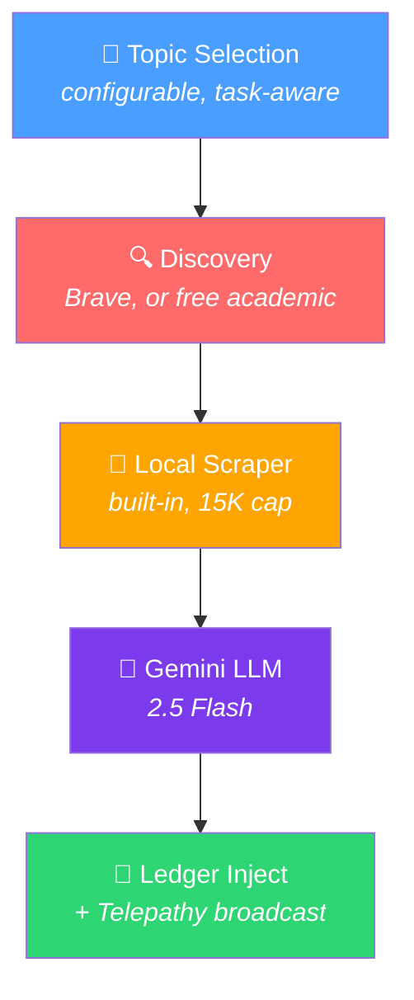

# 🧠 Web Scholar — Setup & Configuration Guide

> **Version:** 5.4.0+
> **Status:** Production Ready
> **Requires:** a text-provider key for synthesis. Search keys are optional — without them Scholar runs on the free academic path.

The **Autonomous Web Scholar** is Prism's background research pipeline that automatically discovers, scrapes, synthesizes, and injects knowledge from the web into your agent's memory — without manual intervention.

---

## Table of Contents

- [Overview](#overview)
- [Prerequisites](#prerequisites)
- [Quick Start](#quick-start)
- [Environment Variables](#environment-variables)
- [Dashboard Controls](#dashboard-controls)
- [How It Works](#how-it-works)
- [Configuration Examples](#configuration-examples)
- [Troubleshooting](#troubleshooting)
- [Cost & Rate Limits](#cost--rate-limits)

---

## Overview

Web Scholar runs as an autonomous pipeline:

```
Topics → Discovery → Local Scrape → LLM Synthesis → Ledger Injection → Telepathy Broadcast
```

**Discovery** picks exactly one source, by whether a web search is possible at
all — not by whether this machine holds a key:

| Condition | Source | Whose credentials |
|---|---|---|
| Signed in to the Synalux portal | Web search | Synalux, server-side |
| `BRAVE_API_KEY` set locally | Web search | Yours |
| Neither | PubMed + ERIC + Semantic Scholar in parallel, then Yahoo if those return nothing | None needed |

When both are available the portal wins: credentials and query redaction stay
server-side. One exception: if the portal refuses your **plan** (a free
account gets 403 "requires Standard plan or higher") and you configured your
own `BRAVE_API_KEY`, that key is used — the same footing as a user who never
signed in. An outage, a quota, or an expired login never turns into a direct
provider call with your query.

If the web search fails and no own key can answer it, the run continues on the
free academic path and says so at the top of its report. A web search that
succeeds with zero results ends the run with "No articles found". **Scraping is always the built-in local
scraper** — Firecrawl is never called.

Triggering:
1. **Manual** — the `scholar_research` MCP tool, or the Dashboard "Scholar (Run)" button. This is the only local mode.
2. **Scheduled** — server-side only, via portal cron (`/api/v1/cron/scholar`, every 6h). The client-side auto-scheduler was removed in v18.0.0 after parallel MCP instances produced 5,293 garbage entries; `startScholarScheduler()` still exists in `src/backgroundScheduler.ts` but nothing calls it, so `PRISM_SCHOLAR_INTERVAL_MS` has no effect on a local install.

---

## Prerequisites

Only the text-provider key is genuinely required:

| # | Key | Provider | Purpose | Required | Get It |
|---|-----|----------|---------|----------|--------|
| 1 | A text provider key | Google AI Studio, OpenAI, or Anthropic | LLM synthesis | ✅ Yes | [aistudio.google.com/apikey](https://aistudio.google.com/apikey) |
| 2 | `BRAVE_API_KEY` | Brave Search | Web discovery on your own key. Not needed if you are signed in to the Synalux portal, which supplies search server-side | ❌ No | [brave.com/search/api](https://brave.com/search/api/) |
| 3 | `FIRECRAWL_API_KEY` | Firecrawl | **Currently unused** — kept so existing `.env` files do not break | ❌ No | [firecrawl.dev](https://www.firecrawl.dev/) |

> [!IMPORTANT]
> Without any search credentials the pipeline still runs, using the free
> academic path.
> The text provider can be Gemini (`GOOGLE_API_KEY`), OpenAI (`OPENAI_API_KEY`),
> or Anthropic (`ANTHROPIC_API_KEY`).
>
> `GOOGLE_API_KEY` above is the **AI Studio** key used for synthesis. It is not
> a search key. Prism had a separate Google Custom Search discovery path behind
> `GOOGLE_SEARCH_API_KEY` + `GOOGLE_SEARCH_CX`; it has been removed
> because Google closed that API to new customers in 2025 and discontinues it
> on 2027-01-01. Do not re-add it.

---

## Quick Start

### 1. Set your API keys

Add these to your shell profile (`~/.zshrc`, `~/.bashrc`), or `.env` file:

```bash
# Required: a text provider for synthesis (any one of these)
export GOOGLE_API_KEY="your-google-ai-studio-api-key"

# Optional: your own web-search key. Not needed when you are signed in to the
# Synalux portal on a plan that includes search, and not needed at all for the
# free academic path.
export BRAVE_API_KEY="your-brave-search-api-key"
```

### 2. Enable the Scholar

```bash
export PRISM_SCHOLAR_ENABLED=true
```

On a local install runs are started by hand — the dashboard's **Scholar
(Run)** button or the `scholar_research` tool. `PRISM_SCHOLAR_INTERVAL_MS`
does not schedule anything here (see the table below).

### 3. Start the server

```bash
# Option A: Standard MCP server (for IDE integrations)
node dist/server.js

# Option B: Explicit local storage with dashboard
PRISM_STORAGE=local \
PRISM_SCHEDULER_ENABLED=true \
PRISM_SCHOLAR_ENABLED=true \
PRISM_DASHBOARD_PORT=3333 \
node dist/server.js
```

### 4. Verify

Open the Mind Palace Dashboard using the tokenized URL from the startup log
(e.g. `http://localhost:3333/?token=<random>`) and click **Scholar (Run)**.
When the run finishes, a new ledger entry whose summary starts with
`Research: <topic>` is saved (event type `learning`, importance 7).

The `Web Scholar` line on the **BACKGROUND SCHEDULER** card reads
`🔴 Disabled` on every local install. It reports the client-side
auto-scheduler, which was retired in v18.0.0; it does not mean the pipeline
is off.

---

## Environment Variables

### Required Keys

| Variable | Required | Default | Description |
|----------|----------|---------|-------------|
| Text provider key | ✅ Yes | — | `GOOGLE_API_KEY`, `OPENAI_API_KEY`, or `ANTHROPIC_API_KEY`. Powers LLM synthesis. |
| `BRAVE_API_KEY` | ❌ No | — | Brave Search Pro API key. Enables web discovery on your own key; unnecessary when signed in to the Synalux portal. Without either, the free academic path is used. |
| `FIRECRAWL_API_KEY` | ❌ No | — | Currently unused. Scraping always uses the built-in local scraper, and discovery no longer consults this key. |

### Scholar Configuration

| Variable | Required | Default | Description |
|----------|----------|---------|-------------|
| `PRISM_SCHOLAR_ENABLED` | ❌ No | `false` | Turns on the startup configuration check. On a local install the pipeline itself runs whenever it is triggered (dashboard button or `scholar_research` tool). |
| `PRISM_SCHOLAR_INTERVAL_MS` | ❌ No | `0` | **No effect on a local install** — the client-side scheduler that read it was retired in v18.0.0 and `startScholarScheduler()` has no caller. Local runs are manual; scheduled runs happen server-side via portal cron. |
| `PRISM_SCHOLAR_TOPICS` | ❌ No | `ai,agents` | Comma-separated list of research topics. Example: `ai,agents,security,performance` |
| `PRISM_SCHOLAR_MAX_ARTICLES_PER_RUN` | ❌ No | `3` | Maximum articles to process per research sweep. Controls API costs. |

### Background Scheduler

| Variable | Required | Default | Description |
|----------|----------|---------|-------------|
| `PRISM_SCHEDULER_ENABLED` | ❌ No | `false` | Enables the background scheduler (also runs TTL, decay, compaction tasks). |
| `PRISM_SCHEDULER_INTERVAL_MS` | ❌ No | `43200000` (12h) | Scheduler sweep interval for maintenance tasks. |

> [!NOTE]
> `PRISM_SCHEDULER_ENABLED` controls the maintenance scheduler. `PRISM_SCHOLAR_ENABLED` controls the research pipeline. The maintenance scheduler does not run Scholar; scheduled research is the portal cron.

---

## Dashboard Controls

### Scholar (Run) Button

The **🧠 Scholar (Run)** button appears in the Background Scheduler card on the dashboard. Clicking it:

1. Sends a `POST /api/scholar/trigger` request
2. Fires the Scholar pipeline in the background (non-blocking)
3. Shows a toast notification with the result

This button works **regardless** of whether automatic scheduling is enabled — you can always trigger a manual research run.

### Status Indicators

| Indicator | Meaning |
|-----------|---------|
| 🟢 Enabled (every Xm) | Scholar is running automatically on a schedule |
| 🔴 Disabled | Scholar is not enabled (check env vars) |

---

## How It Works

### Pipeline Architecture



### Key Design Features

- **Reentrancy Guard** — Only one Scholar pipeline can run at a time (prevents duplicate research)
- **Task-Aware Topics** — When Hivemind is enabled, Scholar biases topic selection toward active agent tasks
- **Cost Control** — Content is capped at 15K characters per article; max articles per run is configurable
- **Hivemind Integration** — Registers on the Radar during execution and broadcasts findings via Telepathy

---

## Configuration Examples

### Local install (manual runs)

```bash
export GOOGLE_API_KEY="..."          # or OPENAI_API_KEY / ANTHROPIC_API_KEY
export BRAVE_API_KEY="..."           # optional: omit when signed in to the portal
export PRISM_SCHOLAR_ENABLED=true
export PRISM_SCHOLAR_TOPICS="ai,agents,typescript,security"
export PRISM_SCHOLAR_MAX_ARTICLES_PER_RUN=3
```

Runs start from the dashboard's **Scholar (Run)** button or the
`scholar_research` tool. `PRISM_SCHOLAR_INTERVAL_MS` and
`PRISM_SCHEDULER_ENABLED` do not schedule Scholar on a local install.

### No search key at all (free academic path)

```bash
export GOOGLE_API_KEY="..."
export PRISM_SCHOLAR_ENABLED=true
```

Discovery uses PubMed, ERIC and Semantic Scholar, then Yahoo. Nothing else
changes.

### Cost-conscious (own Brave key)

```bash
export GOOGLE_API_KEY="..."
export BRAVE_API_KEY="..."
export PRISM_SCHOLAR_ENABLED=true
export PRISM_SCHOLAR_MAX_ARTICLES_PER_RUN=1
```

---

## Troubleshooting

### "🔴 Disabled" on Dashboard

**Cause:** The `Web Scholar` line on the BACKGROUND SCHEDULER card reports the
client-side auto-scheduler, which was retired in v18.0.0 and is never started.
It reads Disabled on every local install, whatever the environment says.

**Fix:** None needed. Trigger runs with **Scholar (Run)** or the
`scholar_research` tool; scheduled runs come from the portal cron.

### Scholar Runs But No Ledger Entries Appear

**Cause:** Discovery found nothing, or a later stage failed. Check the server
logs for:
- `[WebScholar] Web search unavailable, continuing on free sources:` — the
  portal refused the search (free plan, expired login) or the Brave key was
  rejected. The run went on with the academic sources and its report says so.
- `[WebScholar] Pipeline failed:` — followed by the specific error
- `Warning: no web search configured` — at startup; the free academic path is
  in use

**Fix:** Confirm the text-provider key is set, and for web search either a
portal login on a plan that includes it or your own key:
```bash
echo "GOOGLE_API_KEY=${GOOGLE_API_KEY:+SET}"
echo "BRAVE_API_KEY=${BRAVE_API_KEY:+SET}"
```

### "Model not found" / 404 Error

**Cause:** The Gemini model name has been deprecated by Google.

**Fix:** Update `src/utils/llm/adapters/gemini.ts` — change `TEXT_MODEL` to the latest Gemini Flash model. As of v5.4.0, Prism uses `gemini-2.5-flash`. Rebuild with `npx tsc`.

### No Debug Output

Scholar uses `debugLog()` which only outputs when the `DEBUG` environment variable is set:
```bash
export DEBUG=true
```

---

## Cost & Rate Limits

### Per Scholar Run (Default: 3 Articles)

| Stage | Calls | Estimated Cost |
|-------|-------|----------------|
| Web search — Synalux portal | 1 search query | Included with a plan that has search |
| Web search — own `BRAVE_API_KEY` | 1 search query | ~$0.005 |
| Free academic path | PubMed + ERIC + Semantic Scholar, then Yahoo | $0 |
| Local scrape | 1-3 pages | $0 |
| Gemini 2.5 Flash | 1 synthesis call | ~$0.001 |
| **Total per run** | | **~$0.001-0.006** |

### Monthly Estimates

Local runs are manual, so the monthly cost is the per-run figure times the
number of runs you trigger. Scheduled research happens in the portal on
portal-side credentials; none of the keys above are spent by it.

---

## Related Documentation

- [Architecture Overview](ARCHITECTURE.md) — Full system design
- [README](../README.md) — Project overview and setup
- [Roadmap](../ROADMAP.md) — Upcoming features
